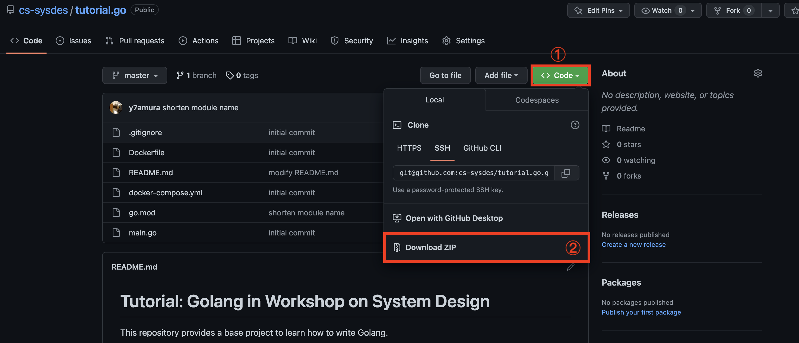

# 01: 演習のための準備
第1回は，演習を進めるにあたって必要な以下の事項について説明します．
1. Go言語プロジェクト
2. Dockerコンテナ上でのプログラムの実行
3. 入門Go言語

Dockerなどの開発環境のインストールおよび設定は済んでいるものと仮定しています．
まだの方は [HOME - 開発環境など](index.md) を参考に開発環境を整えてから進んでください．


## Go言語プロジェクト
この演習では，扱う内容に応じて最低限のプログラムと実行環境の設定からなるプロジェクトテンプレートを配布し，資料の内容にしたがって配布したプロジェクト内のファイルを編集する形式で演習を進めます．
編集後のプロジェクトの提出などは求めません．

配布するプロジェクトテンプレートには，初期状態としてとりあえず動く程度のプログラムしか入っていません．
必要に応じて関数を定義したり，ファイルを分割したり，ディレクトリを新たに作ってファイルを移動したり，etc. といった作業が要求されます．
資料中にて新たなファイルの作成を指示する場合もありますが，基本的には各自の判断でファイル分割やディレクトリ (Go言語では特に「パッケージ」と呼びます) の切り分けなど，自由に編集して構いません．

### プロジェクトの取得
今回使用するプロジェクトを以下のURLよりダウンロードしてください．

<https://github.com/cs-sysdes/tutorial.go>

GitHub の扱いに慣れている方は直接 clone してもらって構いません．
そうでない方は，リンクからページを開き，下の画像の通り「Code」→「Download ZIP」と押すと，zip形式でプロジェクトをダウンロード可能です．
ダウンロードしたzipファイルを展開したら準備完了です．



<!-- ### プロジェクトの構成 -->
今回使用する tutorial.go は，以下のファイル群で構成されています．
- README.md
- Dockerfile
- docker-compose.yml
- go.mod
- main.go

Dockerfile および docker-compose.yml は，プログラム実行時に使用する仮想環境についての設定ファイルです．
演習内で編集することはないと思います．

go.mod は Go言語 の開発ツールである `go` コマンドによって参照されるプロジェクトの設定などに関するファイルです．
プロジェクト使用するコンパイラのバージョンを指定したり，依存する外部ライブラリの管理などを行うために必要なファイルです．
外部ライブラリの追加は `go` コマンドで実行することができるため，このファイルも直接編集する機会は少ないです．

main.go が今回の実行対象である Go言語 で書かれたプログラムです．
内容を以下に示しますが，おそらく Go言語 に触れたことがない人でも，実行すると何が起こるのか想像がつくのではないでしょうか．

```go
package main

import "fmt"

func main() {
    fmt.Println("Hello world!")
}
```

型の宣言方法や識別子の可視性など Go言語 特有のルールや機能も存在しますが，Go言語 はかなり C言語 に近い印象を個人的に持っています．
みんなが大好きな「ポインタ」もちゃんとあります．


## Dockerコンテナ上でのプログラムの実行
ここでは仮想環境上でプログラムを実行する方法を説明します．
Dockerの管理する仮想環境は一般に「コンテナ」と呼ばれるため，以降では単に「コンテナ」あるいは「Dockerコンテナ」と表記します．

この演習では基本的にコマンドライン上での実行を想定しています．
たとえば資料中に`$ echo "Hello world!"`と書かれている場合，これはコマンドライン上で `echo` コマンドを "Hello world!" という文字列を引数として実行することを意味します．
先頭の "$" を入力する必要はありません．

### コンテナの起動
いま `~/sysdes/tutorial.go` にダウンロードしたプロジェクトが展開されていると仮定しましょう．
このパスは各自の環境で置き換えてください．

ターミナルエミュレータを起動し，以下のコマンドを打ち込むことでコンテナを起動することができます．
"#" 以降はコメントなので入力する必要はありません．
```sh
$ cd ~/sysdes/tutorial.go  # プロジェクトディレクトリへ移動
$ docker-compose up -d     # 仮想環境の起動
```

初回起動には少し時間がかかりますので，気長に待ちましょう．

「`docker-compose` コマンドが見つからない」といったエラーが出ている場合，Docker のインストールが正常に完了していない可能性があります．
Docker のインストールが完了していることや，コマンドへパスが通っていることなどを確認してください．
Mac や Linux では自動的にパスの通っている場所へ実行ファイルを配置してくれることが多いですが，特に WSL を使用せずに Windows のコマンドプロンプトで実行する場合にはパスの設定などが別途必要になることがあります．

<div class="memo">
<code class="hljs">docker-compose</code> は通常複数のコンテナを管理するために使用します．
ここでは Go言語 実行環境として 1 つのコンテナしか扱っていませんが，演習後半 (実践編) では実際に複数のコンテナを同時に立ち上げます．
</div>

### プログラムの実行
コンテナが起動しだら実際にプログラムを動かしてみましょう．

Go言語 は C言語 や Java などと同じコンパイラ型ですが，ビルドツールである `go` コマンドを使うことでプログラムを直接実行することができます．
ただし，ここでは Dockerコンテナ 上で実行するため，少し長いコマンドを打つ必要があります．
go.mod が存在するディレクトリ (`~/sysdes/tutorial.go`) 内にて以下のコマンドを実行してください．
```sh
$ docker-compose exec app go run main.go
Hello world!
```

このコマンドは主に 2 つの部分からなります．<br>
前半部分：`docker-compose exec app` は，"app" と名付けられたコンテナ上でプログラムを実行するためのコマンドです．
詳細は省略しますが，プロジェクトディレクトリ内の docker-compose.yml を覗くと名前を設定している記述があり，名前を変更することも可能です．<br>
後半部分：`go run main.go` は，Go言語ビルドツールによって main.go ファイルを実行するためのコマンドです．
これらを組合わせることで，ローカル端末から "app" コンテナ上で main.go を実行し，その結果をローカル端末上で確認することができるようにしています．


<div class="memo">
演習前半 (基礎編) の内容については，ローカルに Go言語 の実行環境を持っている人は単純に <code class="hljs">go run main.go</code> などとして直接実行する方が早いです．
演習後半 (実践編) において <code class="hljs">docker-compose</code> コマンドで複数のコンテナを起動順序の制約を守りながら並行して立ち上げる必要があるので，今のうちから慣れてもらうためにあえて面倒な方法を紹介しています．
</div>

### 仮想環境の停止
演習が終了したら，忘れずにコンテナを停止しましょう．

起動コマンドが `up` だったので，停止は `down` です．
プロジェクトディレクトリ (`~/sysdes/tutorial.go`) 内で以下のコマンドを実行してください．

```sh
$ docker-compose down
```

停止時にも少し時間がかかる場合があります．
想環境の停止においてエラーが発生することはほとんどありませんが，たとえばプロジェクトのパスを変更 (ディレクトリの移動や名前の変更) してしまうと正常に停止できない場合があります．

<div class="memo">
情報工学系演習室 (計算機室) の端末で演習を進めている方へのお願いです．
計算機室の端末では Docker 周りに一部不安定な挙動が見られます．
そのため，<b>演習が終了したらコンテナを停止した上で，必ず端末を再起動</b>してください．
ログアウトではなく，再起動でお願いします．
</div>

以上の手順は演習を進める上で毎回使います．
忘れたらここを見直せば良いので頑張って覚える必要はないですが，たとえば `$ make start` で起動できるよう Makefile を設置するなど，各自で工夫をしてもよいと思います．


## 入門Go言語
演習で使用するGo言語について簡単に勉強しましょう．

tutorial.go では画面に "Hello world!" と出力するプログラムを扱いました．
ここからは，これをベースとして色々な言語機能を説明し，プログラムを実際に変更して動かしてみることで，Go言語に入門 していきたいと思います．

すでにGo言語に慣れている人は，これ以降をスキップして<!-- [第2回](02_http.md) に進んで-->もらって構いません．
お疲れさまでした．

### main.go 解説
初期状態の tutorial.go/main.go は以下のようになっています．
```go
package main

import "fmt"

func main() {
    fmt.Println("Hello world!")
}
```

1行目 `package main` はパッケージ宣言と呼び，この<b>ファイルが属するパッケージ</b>を明示しています．
Go言語 ではすべてのファイルが「パッケージ」に属しており，パッケージの集合を「モジュール」と呼んでいます．
すなわち，いままでプロジェクトと呼んでいたものは，tutorial.go という名のモジュールであるということになります．

main は特別なパッケージ名で，実行基点となる <b>main 関数が存在するファイルは必ず main パッケージ</b>に属している必要があります．
また，一つのパッケージに複数の main を配置することは可能ですが非推奨となっており，今回の場合ルートディレクトリに別の main 関数を持ったファイルを配置して main パッケージであると宣言すると，ビルドツールが文句を言います．
最近流行の Rust ほどではありませんが，Go言語 もビルドツールがなかなかお節介です．

3行目 `import "fmt"` は，このプログラムで<b>使用するパッケージをインポート</b>するための宣言です．
C言語 でいうところの `#include <...>` 文みたいなものだと考えてください．
なお，プログラム中で使用していないパッケージを import していると，コンパイラがエラーを出します．
警告ではなくエラーです．


5行目 `func main()` は，C言語 における `void main(void)` と同等と考えて差し支えありません．
Go言語 は C言語 と同様に `main` という識別子をもった関数を実行基点としています．
C言語 では普通 `int main(void)` と書きますが，Go言語 の main関数 は戻り値を持たないため，戻り値型の宣言がありません．

6行目 `fmt.Println(...)` は<b>標準出力へ文字列を出力する関数</b>を呼び出しています．
先ほど `fmt` パッケージを import したのは，ここで `fmt` パッケージ内の `Println` 関数を使用するためです．
パッケージ内の関数や変数といった識別子を呼び出す場合には，このように「<b>パッケージ名 + 識別子名</b>」の形式で記述します．

`Println` 関数は，Java の `System.out.println` メソッドと同じものだと思ってください．
引数で与えた文字列を，改行付きで標準出力へ出力します．

以上が初期状態での main.go の内容になります．
ここからは，このファイルを編集しながら代表的な言語機能を見ていきましょう．

### 変数と定数
いま文字列 "Hello world!" を直接 `fmt.Println` 関数に入力していますが，これを一旦変数に格納した上で関数に渡すよう変更してみましょう．

まず C言語 と最も異なるルールとして，Go言語 では<b>型を後置</b>します．
すなわち，Go言語 における変数宣言の基本的な形式は `var 変数名 型名` になります．
先頭の `var` はこれが変数宣言であることを意味し，そのあとに変数名，変数の型が続きます．

同じ型の変数を複数宣言する場合には，`var i, j, k int` などのようにまとめることができます．
さらに，異なる型の変数を複数宣言する場合には，以下のように `var` キーワードをグループ化することもできます．
```go
var (
    i, j, k int
    v string
)
```
これらの機能は後ほど登場する `const` キーワードでも同様です．

#### 局所変数

具体的に main.go を変数を使って書き換えた例を示します．
```go
package main

import "fmt"

func main() {
    var message string = "Hello world!"  // string型の変数messageを宣言し"Hello world!"を代入
    fmt.Println(message)
}
```

ただ変数を宣言し，値を代入しているだけですので，あまり迷うことはないかと思います．
ちなみに Go言語 では C言語 と同様に `//` や `/* */` によってコメントを記述可能です．

さて，Go言語 ではこれをもう少し効率的に書くことができます．
1 つ目の改善点として，変数の宣言と初期化 (代入) を同時に行う場合，型は初期値から推論できるので書く必要がありません．
つまり以下のような書き方が可能です．
```go
// messageの型は書かなくても初期値からstringに推論される
var message = "Hello world!"
```

2 つ目の改善点として，<b>関数内や制御ブロック内などといった局所スコープ</b>に限り，以下のように書いても同じ意味になります．
```go
// 下記は var message = "Hello world" と同等
message := "Hello world!"  // = ではなく := であることに注意!!
```

ここまでの理解から以下のコードが合法になることがわかります．
```go
package main

import "fmt"

func main() {
    message := "Hello world!"
    fmt.Println(message)
}
```

注意点として，`:=` では同じスコープ内で複数の同じ変数を束縛できません．
すなわち，以下のコードはコンパイルエラーになります．
```go
func main() {
    message := "Hello world!"
    message := "Hello, Masu!"    // これはmessageの再定義なのでダメ
    message = "Hello, Kazuya!"   // これはmessageへの再代入 (既存の変数の変更) なのでOK
}
```
ただし，このルールには一部例外があります．
詳細は後日，おそらく演習内で例外的な状況が出てくると思いますので，そのときに説明を加えます．

#### グローバル変数・定数
Go言語 では，C言語 と同様にグローバル変数を定義することができます．
ただし，`:=` を用いた略記法はグローバル変数では使用できないことに注意してください．

また，グローバル変数は定数としての利用を想定していることが多いかと思います．
そうした場合は，`var` を `const` に変えることで変数ではなく定数を宣言することができます．
グローバル定数を使って書いた例を以下に示します．
```go
package main

import "fmt"

const message = "Hello world!"  // 型推論は効く

func main() {
    fmt.Println(message)
}
```

定数は関数スコープ内などでも定義できますが，用途が限定されるためかあまり見かけたことがありません．
個人的には `const` 指定好きなので使いますが……

### 関数
変数 (定数) が使えるようになったら，次は関数です．
いま `main` 関数の中は非常に単純ですが，コードが複雑化すると関数を分けたくなります．

Go言語 での関数の定義方法は `func 関数名(引数リスト) 戻り値型 { 処理の内容  }` となっています．
型は後置するルールなので，戻り値型も後ろになっています．

ここでは引数として名前を受け取り，挨拶を返す関数 `hello` を作成してみます．
```go
package main

import "fmt"

func main() {
    greet := hello("Masu")
    fmt.Println(greet)
}

func hello(name string) string {
    return fmt.Sprintf("Hello, %s!", name)
}
```
当然ながら引数リストでも型は後置するルールなので，`name string` で `name` という string 型の仮引数を設定しています．

C言語と同様に戻り値を返すには `return` キーワードを使用します．
`fmt.Sprintf` は C言語 の `sprintf` 関数 (`<stdio.h>`) と同じものです．

これを実行すると以下のような結果を得られるはずです．
```sh
$ docker-compose exec app go run main.go
Hello, Masu!
```

Go言語 の戻り値には C言語 にはない機能があります．
たとえば，C言語の `printf` 関数が整数値を返すのと同様に．先ほどから使用している `fmt.Println` 関数も戻り値を持ちます．
普段はほとんど使いませんが，`fmt.Println` 関数の戻り値は `(int, error)` であると定義されています．
Go言語 ではこのように複数の戻り値を返すことができ，至る所でこの機能を使用しています．
万が一 `fmt.Println` 関数の戻り値を受け取りたい場合には，以下のように書く必要があります．
```go
i, err := fmt.Println("Hello, Kazuya!")
```

ただし，常に両方の戻り値が必要というわけでもないと思うので，戻り値を破棄する特別な変数名として `_` (アンダースコア) が予約されています．
つまり，先ほどの例で第2戻り値のエラー情報だけ欲しい場合には，以下のように書けます．
```go
_, err := fmt.Println("Hello, Kazuya!")
```

### 識別子の命名規則と可視性
さきほど関数宣言で `hello` という識別子を使いました．
また，グローバル変数を定義する際も `message` という識別子を使いました．
何も変なところはないように思いますが，実は意識して<b>小文字から始まる識別子</b>を使いました．
一方で `fmt.Println` 関数は，`fmt` はパッケージ名なので無視するとして，関数名は<b>大文字から始まる識別子</b>になっています．

実は Go言語 では，変数や関数の識別子名として，<b>先頭が大文字である場合と小文字である場合を区別</b>します．
そして，これらを区別することで，<b>パッケージ外からの識別子の可視性</b>をコントロールしています．

具体的には，`fmt` パッケージ内にも先頭が小文字の識別子が存在しますが，これらの識別子を `main` パッケージから参照することはできません．
<b>小文字はじまりの識別子はパッケージローカル</b>，すなわち Java でいえば「アクセス修飾子なし」の状態であるということになります．
一方，<b>大文字はじまりの識別子は Java でいうところの public</b> になるため，`main` パッケージから `fmt.Println` 関数を参照することができるということです．

このルールは現在のところあまり意識する必要はありません．
ですが，今後プロジェクトが大きくなってパッケージを分割していく必要が生じた際に落とし穴になる可能性があるため，ここで説明をしました．
今後も必要に応じて触れる予定でいます．

### 制御構造
複雑な処理を実行するために必要な機能である条件分岐と繰り返しについて説明します．

#### 条件分岐
条件分岐には，主に `if` および `switch` を使用します．

##### 条件分岐 1: `if`

`if` はC言語とほとんど同じですが，Go言語 では<b>条件節に丸括弧が不要</b>です．
```go
// iは整数型の変数
if i % 2 == 0 {
    fmt.Println("Even!")
} else {
    fmt.Println("Odd!")
}
```

##### 条件分岐 2: `switch`

次に `switch` ですが，通常の使い方はこちらもだいたい同じです．
```go
// iは整数型の変数
switch i {
    case 42:
        fmt.Println("Answer to the Ultimate Question of Life, the Universe, and Everything")
    case 57:
        fmt.Println("Prime!")
    default:
        fmt.Println("Common number")
}
```
`if` と同じように，`switch(i) {` ではなく `switch i {` と書けます．
ただし，C言語 との違いとしてデフォルトで fall through しないようになっています．
したがって，至る所に `break` と書く必要がありません．
一方で `break` の代わりに `fallthrough` と書くことで，わざと fall through させることもできます．

Go言語 の `switch` における便利な機能として，複数のマッチ対象を一度に書く機能があります．
また，対象は整数値に限定されず，他の型でも渡すことができます．
以下に具体例を示します．
```go
// prefecture はstring型の変数
switch prefecture {
    case "Hokkaido":
        return "countryside"
    case "Tokyo", "Yokohama":  // "Tokyo" か "Yokohama" の場合にマッチ
        return "metropolis"
    default:
        return "unknown"
}
```

さらに，Go言語 の `switch` は複数条件を持つ `if` として使用することもできます．
```go
func Collatz(n int) bool {
    switch {    // 対象がないがtypoではない
        case n < 1:
            return false
        case n == 1:
            return true
        case n % 2 == 0:
            return Collatz(n / 2)
        default:
            return Collatz(3 * n + 1)
    }
}
```
複数の `case` 条件を満たす場合には，より上に書かれたものが優先されます．
すべての `case` が実行されるわけではないので注意してください．


#### 繰り返し
繰り返しを表現するには `for` を使用します．
`while` はありません．

例として 1 から 100 までの整数を出力するプログラムを示します．
```go
for i := 1; i <= 100; i++ {
    fmt.Println(i)
}
```
`for` も C言語 のものとほとんど同じですが，`if` と同様に丸括弧を書きません．
ここで，繰り返し変数の定義として `i := 1` を与えていますが，これは `for` スコープ内の局所変数なので `:=` による型推論を含めた初期化 + 定義が可能となっています．

より便利な例を見てみます．
Go言語 にも当然データ構造としての<b>配列</b>があるわけですが，配列のインデックスと要素を順に出力したい状況はよく発生します．
そうした場合，以下のように Java の拡張for文のような書き方ができます．
```go
animals := []string{"dog", "cat", "Tasmanian devil"}
for i, a := range animals {
    fmt.Printf("%d: %s\n", i, a)
}
```
インデックス値が不要の場合には `_` で受けて破棄することで対応できます．

Go言語に `while` はありませんが，`for` によって `while` と同等のことが表現できます．
```go
for i < 10 { ... }  // while(i < 10) に相当
for true { ... }    // while(true) に相当 (無限ループ)
```
特に 2 つめの無限ループに関しては特別な記法があり，条件節を省略して
```go
for { ... }   // for true { ... } と同等
```
と書くだけで十分です．


##### 練習問題
ここまでの理解度を測るため，FizzBuzz問題を解いてみましょう．

手順として以下の要件を満たす関数を順に作成し，最後に組合せることで1〜30までの数値についてFizzBuzzを表示するプログラムを作成してください．

1. 3の倍数 を判定する関数
    - 入力：整数値 (`int`)
    - 出力：入力が 3の倍数 であれば `true`，それ以外は `false`
2. 5の倍数 を判定する関数
    - 入力：整数値 (`int`)
    - 出力：入力が 5の倍数 であれば `true`，それ以外は `false`
3. 15の倍数 を判定する関数
    - 入力：整数値 (`int`)
    - 出力：入力が 15の倍数 であれば `true`，それ以外は `false`
4. 出力すべき文字列を返す関数
    - 入力：整数値 (`int`)
    - 出力：入力が 3の倍数 であるが 5の倍数 でなければ `"Fizz"` を，3の倍数 でないが 5の倍数 であれば `"Buzz"` を，15の倍数 であれば `"FizzBuzz"` を，それ以外は入力値を文字列化して返す

<div class="memo">
整数値を文字列化するには，<code class="hljs">fmt.Sprintf</code> 関数か，strconv パッケージ名の <code class="hljs">strconv.Iota</code> を使用するとよい．
</div>

[ここから実装例が確認できます](https://gist.github.com/y7amura/262cbbc739017ca2713f4a95fba80731)

### ポインタ
Go言語 にもポインタが存在し，役割や使い方などは C言語 のポインタとほぼ同じです．
ただし，Go言語 は GC (Garbage Collection) 機能を持つ言語なので，C言語 のポインタに比べれば制約も緩く，やや扱いやすいものになっています．

<div class="memo">
本演習に限らず，ポインタの概念が怪しい人は「手続き型プログラミング 発展」などの資料を見直し，復習しておくことを推奨します．
</div>

Go言語 のポインタ変数は，C言語 と同様に型名にアスタリスクを付けることで宣言が可能です．
ただし，型宣言の方法が異なったように，ポインタ変数の型宣言もまた C言語 とは異なり，たとえば整数型ポインタであれば `*int` のように<b>型名の前にアスタリスク</b>がつきます．

また C言語 と同様に，通常の変数に & (アンパサンド) を付けることで，その変数へのポインタを取得できます．
逆にポインタから値を参照したいときも，C言語 と同様にアスタリスクによるデリファレンスが可能です．

これまでの関係を整理すると，以下のようになります．
```go
var i int = 0
var p *int = &i  // 変数iのポインタを取得
var j int = *p   // ポインタ変数pを経由して変数iの値を取得
```

とりあえずポインタ変数を確保して，後から値を代入したい場合には組み込み関数 `new` を使うと良いです．
```go
var p *int
p = new(*int)

*p = 1
```
`new` を使うため誤解が生じるかもしれませんが，`free` はありません．
ポインタ変数 `p` は，不要になれば GC によって勝手に解放されます．

C言語 では無効なポインタ値として `NULL` が定義されていましたが，Go言語 では `nil` になります．
Go言語 では，未初期化のポインタ変数は `nil` を指すことが言語仕様上決まっています．

また，GC がある言語であるため，以下のコードが Go言語 では合法になります．
```go
func NewInt() *int {
    p := 1
    return &p
}

var p *int
p = NewInt()
```
このコードは関数スタックに積まれた局所変数のポインタを返しているので，C言語では合法ではありません．
一方 Go言語 では，これは特にエラーもなく動きます．
実際，Go言語 のコードでは局所変数のポインタどころか即値のポインタすら関数外へ return するようなコードがよく見られます．
代表的な例としては，次のセクションで説明する構造体を関数ローカルで定義し，そのまま return するコードです．
```go
type Person struct {
    Name string
    Age int
}

func NewPerson(name string, age int) *Person {
    return &Person{ name, age }
}
```
C言語 としてみるとなんだか不思議なコードですが，Go言語 では割と普通に見かけます．


##### 練習問題
次のコードがどういう出力になるか考え，実装して確かめてみよ．
```go
package main

import "fmt"

func IncrementV(v int) {
    v = v + 1
}

func IncrementP(p *int) {
    *p = *p + 1
}

func main() {
    v := 0

    IncrementV(v)
    fmt.Printf("v = %d\n", v)

    p := &v
    IncrementP(p)
    fmt.Printf("v = %d\n", v)
}
```


### 配列とスライス
同じ型の複数の値をまとめて扱うためのデータ構造として<b>配列</b>と<b>スライス</b>が存在します．
Go言語 において通常「<b>配列</b>」と呼ぶものは「固定長配列」を意味しており，これは決められた長さを持つデータ構造です．
一方で，「<b>スライス</b>」は一般に「可変長配列」と呼ばれるものであり，こちらはその名の通り長さを変えることができます．

#### 配列
配列 (固定長配列) 定義の基本形は `var 変数名 [長さ]型` になります．
また，初期値を直接与える場合には，`変数名 := [...]型 { 初期値のリスト }` というように長さを推論させることができます．
したがって，配列の型としての記法は `[長さ]型` であり，この点からも長さを指定する必要があることがわかります．

`var 変数名 [長さ]型` の形式で定義された配列は，指定された長さの分だけ型ごとに決められたデフォルト値ですべての要素が初期化されます．
すなわち，以下の例において `a1` と `a2` はすべての要素が等しい 2 つの異なる配列ということになります．
```go
var a1 [5]int
a2 := [...]int{0, 0, 0, 0, 0}
```

配列中の特定の要素は，C言語と同様に `変数名[インデックス値]` でアクセス可能です．
他の多くの言語と同様に，0-based indexing になっています．
```go
a := [...]int{1, 2, 3, 4, 5}
fmt.Println(a[0])  //=> 1
```

Go言語はすべての変数が値として扱われるため，配列もいわゆる値型と呼ばれるような挙動をします．
すなわち，以下のコードにおいて `a2` は `a1` のコピーになり，両変数は別の領域にあるデータを指します．
```go
a1 := [...]int {1, 2, 3, 4}  // 新しい長さ4の配列
a2 := a1                     // a1と同じ内容の新しい長さ4の配列
```

#### スライス
スライス (可変長配列) 定義の基本形は `var 変数名 []型` となり，配列定義から長さの指定が消えた形となっています．
初期値を直接与える場合も長さの指定がないため，`変数名 := []型 { 初期値のリスト }` という表現になります．
スライスの型としての記法は `[]型` です．

`var 変数名 []型` の形式で定義されたスライスは，サイズが 0 になります．
つまり，なにも入っていない状態です．
スライスも配列と同様に `変数名[インデックス]` の形式で各要素にアクセスできますが，サイズ 0 のスライスにアクセスした場合，どのようなインデックス値に対しても範囲外アクセスによりプログラムが異常終了します．

`var 変数名 []型` の形式で定義したスライスは，組み込み関数 `make` によって指定したサイズのスライスとして確保しなおすことができます．
組み込み関数 `make` は引数として型，サイズ，キャパシティの 3 つをとりますが，キャパシティは省略可能です．
キャパシティを省略した場合，おそらくサイズに依存して適切なキャパシティが自動設定されます．
```go
var array []int         // これはサイズ0の整数型スライス
array = make([]int, 5)  // ここでサイズ5の整数型スライスになる (キャパシティは自動設定)
```

<div class="memo">
これは教員自身が Go言語 でプログラムを書くとき (年に1回くらいのイベント) によくやることなのですが，スライスを使った周辺でプログラムが落ちる場合はだいたいサイズ 0 のまま使おうとして範囲外アクセスで落ちていることが多いです．
スライスを宣言した周辺でプログラムが異常停止する場合は，このミスを疑ってみると良いかもしれません．
</div>

スライスも値ではあるのですが，いわゆる参照型のような挙動をします．
スライスはメモリ上での先頭アドレス・サイズ・キャパシティを持っているようなデータ構造なので，スライスのコピーはこれらの値のコピーを意味します．
つまり，以下のコードにおいて `a2` は `a1` の持つ先頭アドレス・サイズ・キャパシティの値をコピーしたものであるため，指している先頭アドレスは同じとなり，実質的に同じものを指す変数となります．
```go
a1 := []int {1, 2, 3, 4}  // a1が持つのは，先頭要素のアドレス，サイズ，キャパシティ
a2 := a1                  // a2が持つのは，a1の先頭要素のアドレス，サイズ，キャパシティ
```

スライスは可変長であるため，組み込み関数 `append` を使って要素を追加し，スライスの長さを変えることができます．
`append` 関数は追加する要素を複数とることができ，追加後のスライスを返します．
```
a1 := []int{1, 2, 3, 4}
a1 = append(a1, 5, 6, 7)    //=> a1 == [1, 2, 3, 4, 5, 6, 7]
```
ここで注意すべきこととして，追加前の `a1` が指していた先頭要素のアドレスと追加後の `a1` が指す先頭要素のアドレスが一致する保証はありません．
要素を追加した結果として `a1` のキャパシティを超えてしまう場合，新たなキャパシティで `a1` を再確保することでスライスの伸長を行うためです．
すなわち，`append` 関数はメモリアロケーションを発生させる可能性があり，場合によってはパフォーマンスに影響が出ることもあります．

追加には `append` 関数がある一方で，削除する関数はありません．
Go言語 では Python のように<b>部分スライス</b>を取得できるので削除関数を自作することはできます．

### 構造体
複数の型をまとめた複合型を作りたい場合，Go言語 では<b>構造体</b>を使用します．
C言語 の構造体と同じものです．

構造体を定義するには `struct` キーワードを使用します．
たとえば，文字列型の名前と整数型の年齢をフィールドに持つ構造体の定義は以下のようになります．
```go
struct {
    Name string
    Age int
}
```
C言語 では構造体を定義する際に構造体名を与えないといけませんでしたが，Go言語 では不要です．
これはそのまま型として機能するので，次のような変数宣言が可能です．
```go
var person struct {
    Name string
    Age int
}
```
構造体変数は以下のように，波括弧を用いてそれぞれのフィールドに代入する値を指定することで初期化できます．
```go
var person struct {
    Name string
    Age int
}{
    "Tech-chan",
    5,            // 最後のフィールド値のあとに改行を入れる場合，ここのカンマは必要
}
```
また，フィールド名を指定して初期化することもできます．
```go
var person struct {
    Name string
    Age int
}{
    Name: "Tech-chan",
    Age: 5,             // 最後のフィールド値のあとに改行を入れる場合，ここのカンマは必要
}
```
フィールド名を指定した初期化方法は，フィールドの宣言順序に依存せずに構造体を初期化したい場合や，一部のフィールドにだけ値を与えたい場合などに有効です．

構造体変数のフィールドへは，Java のインスタンス変数などと同様に `.` (ドット) でアクセスできます．
```go
fmt.Println(person.Name)  //=> Tech-chan
```

構造体変数がポインタの場合，C言語 ではアロー演算子 `->` を使用する必要がありましたが，Go言語 では `.` (ドット) のままで大丈夫です．
```go
p := &person
fmt.Println(p.Name)  //=> Tech-chan
```

さて，ここで Go言語 の識別子の表記と可視性の規則を思い出してみましょう．
<b>小文字はじまりはパッケージローカル</b>で，<b>大文字はじまりは外部パッケージからも参照可能</b>というルールでした．
ここまで何気なくフィールド名を大文字で書いてきましたが，この識別子の命名規則はフィールド名にも適用されます．
すなわち，フィールド名を小文字はじまりで設定した場合，外部パッケージでは構造体変数のフィールドへアクセスできなってしまいます．
この機能を上手に使うと<b>カプセル化</b>を実現できますが，特に構造体のフィール変数については，慣れないうちは間違い防止のためにすべて大文字はじまりで書いておく方が安全かもしれません．


### 型の別名とメソッド
構造体の定義方法はわかりましたが，同じ構造体型を複数の場所で何度も使用する場合に，毎回すべてのフィールド定義を書くのは面倒です．
Go言語 には<b>型に別名をつける</b>機能があるので，これを使って少し楽をしましょう．

型へ別名をつけるためには `type 別名 元の型` という構文を使用します．
C言語 の `typedef` のようなものだと思ってください．

`type` キーワードを使って先ほど定義した構造体に `Person` という型名をつけてみます．
```go
type Person struct {
    Name string
    Age int
}

person := &Person{
    Name: "Tech-chan",
    Age: 5,
}
```
だいぶ見慣れた表現になったのではないでしょうか．

`type` キーワードにはもう一つ特殊な機能があります．
同一パッケージ内で `type` キーワードによって別名を付けた型には，<b>メソッド</b>と呼ばれる特殊な形式の関数を紐づけることができるようになります．
Go言語 には Java のような `class` はありませんが，この機能を使うことでオブジェクト指向的な機能をを実現することができます．

たとえば，構造体 `Person` に文字列へ変換するメソッド `ToString`，および，年齢を 1 歳増やすメソッド `GetOlder` を実装してみます．
```go
type Person {
    Name string
    Age int
}

func (p Person) ToString() string {
    return fmt.Sprintf("Name: %s, Age: %d", p.Name, p.Age)
}

func (p *Person) GetOlder() {
    p.Age = p.Age + 1
}
```
メソッドはこのように `func (変数名 型) 関数名(引数リスト) 戻り値型 {}` の形式で定義することができます．
関数名の前に配置する変数を一般に<b>レシーバ</b>といいます．
レシーバには値型あるいはポインタ型が設定でき，レシーバの内容を変更したい場合にはポインタ型を使用する必要があります．

メソッドの呼び出しは Java などと同様に以下のように行うことができます．
```go
person := Person{
    Name: "Tech-chan",
    Age: 5,
}

fmt.Println(person.ToString())  //=> Name: Tech-chan, Age: 5

person.GetOlder()
fmt.Println(person.ToString())  //=> Name: Tech-chan, Age: 6
```
フィールドへのアクセスと同様に，レシーバをポインタ型で定義した場合であっても，そのままドットでアクセスすることができます．便利．

<div class="memo">
構造体が大きい場合も，変更の有無に関わらずポインタ型とするのが良いでしょう．
レシーバとして値型を設定すると，メソッド呼び出しのたびに構造体のコピーが発生するため，パフォーマンス低下の原因になります．
また，こうした事情からレシーバは常にポインタ型にする開発者もいます．
とはいえ，値型とすることで予期せぬ変更を防ぐことができる利点もあるため，適切に使い分ける方が良い気はします．
</div>

さきほど `type` キーワードは型に別名をつけることができると書きました．
その機能を使用して構造体に名前をつけたわけですが，考えてみれば構造体以外の型でも別名はつけられます．
さらに別名をつけた型には (同じパッケージ内において) メソッドを定義できるというわけです．

つまり，これができます．
```go
type MyInt int

func (i MyInt) ToString() string {
    return fmt.Sprintf("%d", i)
}

fmt.Println(MyInt(5).ToString())  //=> 5
```
ちなみに，7行目において `5.ToString()` と書くことはできません．
きちんと `MyInt` 型に変換してからメソッドを呼ぶ必要があります．
これくらいなら普通に `int` を引数とする関数を定義する方が良いですが，この機能は何かに使えるかもしれませんね．

<!--
### パッケージ
最後に Go言語 の文法ではなく．パッケージの仕組みについて簡単に整理しておきます．

冒頭でも述べた通り，Go言語 ではすべてのファイルが何かしらのパッケージに属し，パッケージの集合であるモジュールが 1 つのプロジェクトになります．
特殊なパッケージである `main` を除いて，パッケージ名には一般にファイルが存在するディレクトリの名前を付けるのが一般的です．
-->

## まとめ
駆け足で非常に浅い Go言語 の入門書ですが，最低限必要になりそうな機能は網羅できたと思います．
Go言語 は慣れると割と書きやすい言語ですが，慣れるまでは変な機能も多く，コンパイラの文句も多いので苦労するかと思います．
これ以降の資料でも可能な限り補足はしていくつもりですが，必要に応じてこのページを見返したり，教員へ質問したり，あるいは自身で調べたりなどによって対応してください．

今回の内容は以上になります．
お疲れさまでした．
