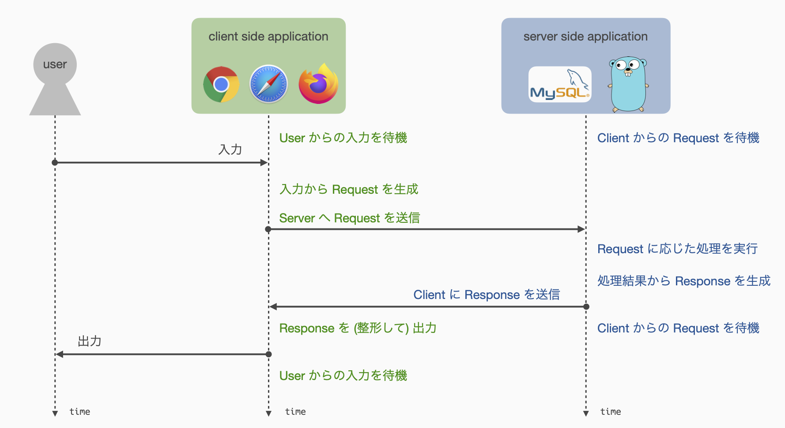
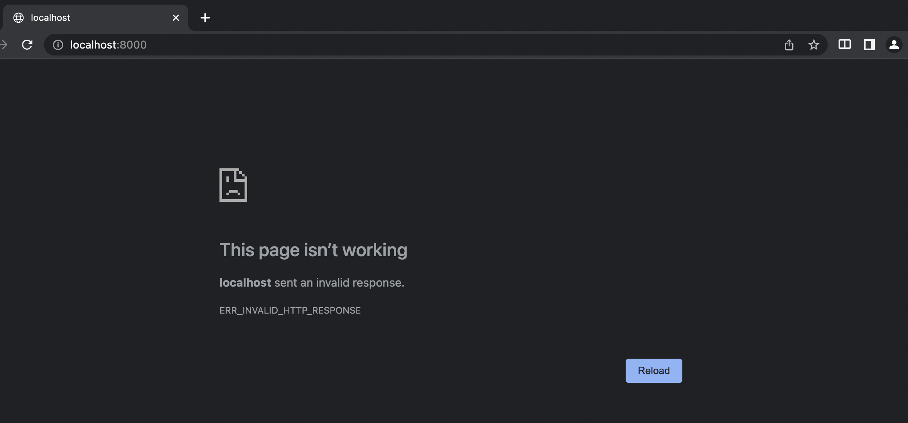

# HTTP通信とルーティング
今回から本格的にWebアプリケーションを構築するための基礎技術に触れていきます．

第2回は，特に以下の内容について扱います．
1. Webアプリケーションの基本的な動作
2. Web通信の決まりごと (Hypertext Transfer Protocol; HTTP)
3. アクセス先の制御 (ルーティング)

また今回の資料は，前回配布したプロジェクトとは異なる新たなプロジェクトをベースとして演習を進めます．
以下のリンクより新しいプロジェクト httpserver.go をダウンロードし，演習が進められるよう展開・配置してください．

<https://github.com/cs-sysdes/httpserver.go>

ダウンロード方法は [前回の資料](01_preliminary.md) を参照してください．

## Webアプリケーションの基本的な動作
<b>Web技術</b>を基盤としたアプリケーションを総称して「Webアプリケーション」と呼びます．
Webアプリケーションは，一般に <b>Client-Server model</b> と呼ばれるアプリケーション形態をとり，Client側アプリケーション (Client-side application) と Server側アプリケーション (Server-side application) という2つのアプリケーションによって構成されます．
基本動作として <b>Client からの要求 (リクエスト)</b>に対して <b>Server が応答 (レスポンス)</b>を返す形式で目的の処理を実行します．



Client-side アプリケーションには <b>Webブラウザ</b> を採用する場合が多いですが，場合によって専用のアプリケーションを提供する場合もあります．
たとえば，Twitter社は自社のサービスとして Webブラウザ上で Tweet を閲覧可能な Twitter Web App を提供していますが，スマホ用にネイティブアプリケーションとして Twitter for Android や Twitter for iPhone などを提供しています．
また，サードパーティ製アプリケーションまで含めると，PC用あるいはタブレット用アプリケーションなど，さまざまなものが提供されています．
本演習では Client-side アプリケーションには Webブラウザ を採用するため，各自で Client-side アプリケーションを構築してもらう必要はありません．

Server-side アプリケーションは Client-side アプリケーションからのリクエストをもとに，必要に応じて内部状態の更新などを行い，Client-side アプリケーションにレスポンスを返します．
アプリケーションの目的に応じてデータベースや認証システムなど，他の外部サービスと連携して処理を行う場合もあります．
本演習で主に扱うのは，こちらの Server-side アプリケーションになります．


### Server-side アプリケーションの実行
[今回配布するプロジェクト](https://github.com/cs-sysdes/httpserver.go)は，Server-side アプリケーションとして最低限の通信機能と動作ログを標準出力へ書き出す機能のみをもつプログラムになります．
本ページの以降の説明では，このプログラムを編集し，Webアプリケーションの動作について学びます．

前回と同様に `~/sysdes/httpserver.go` にダウンロードしたプロジェクトが展開されていると仮定します．
このパスは各自の環境で置き換えてください．

ターミナルエミュレータを起動し，Dockerコンテナを起動します．
```sh
$ cd ~/sysdes/httpserver.go
$ docker-compose up -d
```
プログラムを起動し，2行目ようなログが表示されることを確認してください．
```sh
$ docker-compose exec app go run main.go
2022/10/08 03:30:00 Listen:  [::]:8000
```
冒頭のタイムスタンプや `[::]` の部分は実行タイミングや環境によって異なる場合があります．

このプログラムは Server-side アプリケーションなので，起動すると Client-side アプリケーションからの接続を待機します．
したがって，なにか処理をさせるためには，Client-side アプリケーションからリクエストを送信する必要があります．
先ほど述べた通り，本演習では Client-side アプリケーションとしてWebブラウザを使用することとしているので，ChromeなどのWebブラウザからリクエストを送信してみましょう．

Webブラウザを開き，URL欄に `localhost:8000` あるいは `127.0.0.1:8000` と打ち込んでエンターを押してみましょう．
プログラム側のログは以下のような状態となるはずです．
```sh
$ docker-compose exec app go run main.go
2022/10/08 03:30:00 Listen:  [::]:8000
2022/10/08 03:35:31 Connected by  172.19.0.1.41888
2022/10/08 03:35:31 Connected by  172.19.0.1.41892
2022/10/08 03:35:32 Connected by  172.19.0.1.41896
```
先ほどと同様に，冒頭のタイムスタンプや `172.19.0.1:41888` の部分，出力されるログの数は実行タイミングや環境によって異なります．

これらのログは，Client-side アプリケーションからのリクエストを受信したことを意味します．
この例のように，1 度しかアクセスしていないのに複数のログが出る場合がありますが，使用するWebブラウザによってこの辺の挙動は変わりますので，いまはあまり気にしなくて良いです．

プログラムの方ではリクエストを受け取ったことをログから確認できました．
一方で，Webブラウザの方はどうなっているでしょうか．

おそらく，通常の動作だと「ページが動作していない」などのエラーが表示されていると思います．
たとえば，教員の端末では以下のような表示になっています．



現段階では，<b>これは正常な動作結果</b>ですので，安心してください．

このエラー画面に代えて，Webブラウザ上に ”Hello world" と表示することを次の目標とします．

### Server-side アプリケーションの停止
具体的なプログラムの開発に移る前に，プログラムの停止方法を説明します．

今回以降において実行する Server-side アプリケーションは，基本的に Client-side からのリクエストを待ち受け，リクエストに対してレスポンスを返す動作を繰り返し行うプログラムになります．
したがって，初期状態では停止する方法を実装していません．
停止できなければプログラムを変更して再起動することもできないので，どうにかして停止する必要があります．

停止方法は簡単で，ターミナルエミュレータ上で強制停止シグナルを送信することでプログラムを強制的に落とします．
強制停止シグナルを送信するには，プログラムを実行しているターミナルエミュレータ上で，`Ctrl-c` を入力します．
すなわち，キーボード上の `Ctrl` ボタンとアルファベットの `c` を同時押しすることで，プログラムを停止することができます．

### httpserver.go/main.go 概観
ここで，どうやらうまく動いていないらしいプログラムの中身を簡単に解説します．
スクロールしながら資料を追うのは難しいと思うので，各自の手元で main.go を開きながら進めると良いかと思います．

main.go には以下のように Server-side アプリケーションが実装されています．

<span class="filename">httpserver.go/main.go</span>
```go
package main

import (
	"fmt"
	"log"
	"net" // standard network package
)

func main() {
	// config
	port := 8000
	protocol := "tcp"

	// resolve TCP address
	addr, err := net.ResolveTCPAddr(protocol, fmt.Sprintf(":%d", port))
	if err != nil {
		log.Fatalln(err)
	}

	// get TCP socket
	socket, err := net.ListenTCP(protocol, addr)
	if err != nil {
		log.Fatalln(err)
	}
	log.Println("Listen: ", socket.Addr().String())

	// keep listening
	for {
		// wait for connection
		conn, err := socket.Accept()
		if err != nil {
			log.Println(err)
			continue
		}
		log.Println("Connected by ", conn.RemoteAddr().String())

		// yield connection to concurrent process
		go handleConnection(conn)
	}
}

func handleConnection(conn net.Conn) {
	// close connection when this function ends
	defer conn.Close()

	// write response
	conn.Write([]byte("Hello world."))
}
```

[前回](01_preliminary.md)触れなかった機能として，3--7行目のように，Go言語の import 文は変数宣言などと同じように複数のパッケージを丸括弧でグループ化して一括で宣言することができます．

9--40行目の `main` 関数では，Web通信用にソケットを開き (15, 21行目)，外部からの接続を待機しています (28--39行目)．

このプログラムでは，30行目で受け取った外部からの接続 `conn` を，38行目で `handleConnection` に渡し，具体的なリクエストおよびレスポンスの処理は `handleConnection` 関数内で行うよう設計しています．
したがって，これから `handleConnection` 関数を適切に実装することで，正しく応答する Server-side アプリケーションを開発していきます．

プログラム全体を見渡してみると，以下のような頻出する表現があることに気付きます．
```go
if err != nil {
    ...  // 何かしらの処理
}
```
これは Go言語 を書く上でおそらく一番よく使うであろう<b>エラーハンドリング</b>を行う記述パターンになります．

たとえば15行目では，与えられたポート番号 (`port := 8000`) から通信ソケットのアドレスを取得していますが，与えられた文字列が正しいフォーマットではない場合などに，`net.ResolveTCPAddr` 関数はエラーになります．
Go言語には Java の try-catch のような言語機能がないため，エラーの有無は一般に関数の戻り値として通知されます．
エラーが発生した場合，`net.ResolveTCPAddr` 関数は第2戻り値としてエラーを伝達するため，第2戻り値を受ける `err` が `nil` ではないとき，それはエラーが発生していることを示します．

<span class="filename">httpserver.go/main.go (15--18行目 抜粋)</span>
```go
addr, err := net.ResolveTCPAddr(protocol, fmt.Sprintf(":%d", port))   // ここでエラーが発生した場合
if err != nil {                                                       // ここで err != nil となり
    ...                                                               // ここに記述された処理が実行される
}
```

このように，Go言語では処理が失敗する可能性がある関数はエラーの有無を表す `error` 型の戻り値を返すのが一般的です．
`error` 型の戻り値は，エラーがない，すなわち関数の処理が正常に終了した場合には `nil` になります．
そうでない場合，すなわち，関数の処理に失敗した場合には，エラー情報を含む `error` 型の値になります．
したがって，`error` 型の戻り値の `nil` 判定を行って，エラーの有無を調べるのが一種の記述パターンになっています．

ところで，[前回](01_preliminary.md)の資料中で，通常 `:=` による変数定義は複数回できないが例外もあるという話をしたかと思います．
今回の `err` の定義がその例外で，たとえば `main` 関数の中では，15行目と21行目に同じスコープ内で複数回 `err` を定義しているように見えます．
これについては，この書き方を許容しないと `err` のように使い回される可能性がある変数を最初に `var err error` などと定義しなくてはならず不便なので，例外として許されています．
注意すべきは，`err` の他に別の新たな変数も同時に定義されているという点で，Go言語 ではこの場合に限り複数回同じ変数を定義しても良いということになっています．
つまり，以下のコードは `err` 以外に新たな変数が定義されていないので，コンパイルエラーになります．
```go
func f() {
    err := ThisCanReturnError()
    err := ThisCanAlsoReturnError()
}
```
こういうケースでは，以下のように局所スコープを利用すると良いでしょう．
```go
if err := ThisCanReturnError(); err != nil {
    ...
}
```

少し話が逸れましたが，最後に38行目の `handleConnection` 関数を呼び出す記述について見てみます．
この行では関数呼び出しとして通常通り `handleConnection(conn)` とは書かずに，冒頭に `go` キーワードを付与して `go handleConnection(conn)` として関数呼び出しを行っています．
この記述は Go言語 特有のもので，`handleConnection` 関数を goroutine という機能を使用して<b>並行実行</b>するための記述法です．
すなわち，`handleConnection` 関数は `main` 関数の実行とは独立して並行的に処理され，`main` 関数は `handleConnection` 関数の結果を待たずに次の処理へとプログラムの実行を進めます．
したがって，`handleConnection` 関数の実行によって `main` 関数の実行が妨げられることが (普通は) ないので，`main` 関数は次々と外部からの接続受けて `handleConnection` へ渡すといった動作を絶え間なく行うことができます．

<div class="memo">
Go言語 は並行処理を記述しやすいよう設計されたプログラミング言語であり，C言語であれば <code class="hljs">fork</code> を用いたり，Java であれば <code class="hljs">Thread</code> を使って書かなくてはいけないプログラムの並行実行を，<code class="hljs go">go</code> キーワードを付与した関数呼び出しという形で簡単に実行できるようになっています．
goroutine は面白い機能ですが，この演習において理解すべき言語機能というわけではないですし，かなり奥深い内容になってしまうため，詳細な説明は省略します．
</div>

44行目の `defer` キーワードも Go言語 の面白い機能の一つで，`defer` キーワードを付けて記述された関数呼び出しは，スコープを抜ける際に実行されるようになります．
要するに関数呼び出しの予約機能みたいなものです．
`conn` 変数は外部との接続を表す変数であり，Java でファイル操作を行った時と同様に，使い終わったら `Close` してやる必要があります．
関数の最後に `conn.Close()` と記述しても同じことですが，できれば変数宣言の近くに `Close` 指定がある方がプログラムの見通しが良いため，`defer` を使って事前予約すると良いでしょう．

Go言語 の機能に関する説明もしたため長くなりましたが，このプログラムの一番重要な部分として，47行目において `conn` にバイト列を書き込んでいるのが確認できます．
ここも Java でファイル操作を行った時と同様に，`Write` 関数によって接続元，すなわち Client-side アプリケーションにバイト列で応答を返すことができます．
ただし，さきほど動かしてみてわかった通り，Webブラウザには "Hello world." などとは表示されませんでした．
この原理について以降で説明していきます．


## Web通信の決まりごと (Hypertext Transfer Protocol; HTTP)
Webアプリケーションは Client-side アプリケーションからの <b>リクエスト (Request)</b> に対し，Server-side アプリケーションが <b>レスポンス (Response)</b> を返す形で成り立っています．
このとき，リクエストおよびレスポンスにはそれぞれ決められた形式 (フォーマット) が存在し，こうした形式などを定めた<b>Web通信における約束事 (プロトコル)</b> を <b>Hypertext Transfer Protocol (HTTP)</b> と呼びます．
HTTP は TCP (Transmission Control Protocol) 上で定められたプロトコルであり，TCP/IPモデルでは第4層「アプリケーション層」，OSI参照モデルでは第7層「アプリケーション層」に位置します．

HTTP は本来 HTML や XML といったWeb通信においてやり取りされる Hypertext と呼ばれるデータ形式を扱うためのプロトコルです．
しかしながら，現実的には画像データや音声データ，映像データなど，Web上で利用される様々な形式のデータ送受信に使用されています．

HTTP は通信技術の向上とともに新たなバージョンがいくつか出されています．
代表的なものとして HTTP/1.1，HTTP/2 などがあり，最近では HTTP/3 が正式に標準化されました (2022年6月6日)．
長きにわたって HTTP/1.1 が最も使用率の高いプロトコルでしたが，近年 HTTP2 の使用率が 50% を超えたらしいです (2021年1月)．

<div class="memo">
一般にネットワーク上を流れるデータはすべて<b>バイト列</b>として表現されるため，Web通信におけるリクエストもレスポンスもデータとしては単なるバイト列として扱われます．
通信されるデータが単なるバイト列なので，さまざまなアプリケーションが好き勝手な形式でリクエストを送ったり，あるいはレスポンスを返したりしてしまうと，アプリケーション開発者としては非常に困ったことになります．
特にWebブラウザのような汎用アプリケーションでは，さまざまな Server-side アプリケーションがそれぞれ独自の形式でレスポンスを返してくるとなると，サービスごとのレスポンス形式を個別に知っておく必要があり，これは相当面倒です．
予めデータのフォーマットを定めておき，それに従わないデータは無視して良いということにすると，なにかと便利なわけです．

よくWebサイトなどのURLの先頭についている `http:` というのは，HTTPに従った通信であることを明示するものです．
最近では `https:` とする方が一般的となっていますが，これは HTTP Secure と呼ばれる暗号化された通信経路上で HTTP 通信を行うより安全なプロトコルを表すものです．
</div>

HTTP では，リクエストおよびレスポンスそれぞれについて特定の形式に則って通信を行うよう定めています．
それぞれを一般に <b>HTTPリクエスト</b> および <b>HTTPレスポンス</b> と呼びます．
配布したプログラムがうまく動かなかったのは，どうやらこの辺が原因ではないかと推測できます．

### HTTPリクエスト
HTTPリクエストは，Client-side アプリケーションから Server-side アプリケーションへ送信するリクエストの形式を定めます．
通常は Webブラウザ などが自動的に生成するため，自分で記述する必要はありません．
ただし，専用の Client-side アプリケーションを開発し使用する場合には，サーバへの通信がこの形式に従うよう自身で実装する必要がある場合もあります．

代表的なHTTPリクエストの例を示します．
```txt
GET /index.html HTTP/1.1
HOST: 127.0.0.1
Connection: keep-alive

```

```txt
POST /login HTTP/1.1
`<METHOD>`，`<PATH>`，`<VERSION>` はスペース区切りで識別されます．
したがって，それぞれの項目はスペースを含まない文字列になります．
HOST: 127.0.0.1
Accept-Language: en-US,en;q=0.5
Accept-Encoding: gzip, deflate
Connection: keep-alive
Content: multipart/form-data
Content-Length: 38

user=titech&passwd=extremelysafepasswd
```

これらの形式を統一的に記述すると以下のようになります．
```txt
<METHOD> <PATH> <VERSION>
<HTTP_HEADERS>

<BODY>
```

1行目の `<METHOD> <PATH> <VERSION>` は，<b>リクエストの種類</b>，<b>リクエスト先</b>，および使用する <b>HTTPのバージョン</b> を指定します．
`<METHOD>` の部分は特に <b>リクエストメソッド</b> と呼ばれ，GET や POST の他に，PUT，DELETE，UPDATE などいくつかの種類が定義されています．
`<PATH>` の部分はリクエストを送信する対象であるリソースを指定します．
`<VERSION>` 部分は主に HTTP/1.1 あるいは HTTP/2 である場合が多く，バージョンによって使用できる機能に若干の違いがあるため，ここの指定によって特定の機能が有効か無効かを確認します．
`<METHOD>`，`<PATH>`，`<VERSION>` はスペース区切りで識別されます．
したがって，それぞれの項目はスペースを含まない文字列になります．

2行目の `<HTTP_HEADERS>` はHTTP/1.1以降で有効になった機能であり，サーバ側へリクエストに関するメタ情報を送る役割を持ちます．
形式として，1行に1つの「key」と「value」のペアを記述でき，`<key>: <value>` のようにコロン区切りで記述します．
ここは複数行にわたってメタ情報を載せることができ，以下の通り役割によって分類されたいくつかのヘッダ情報を組合せて記述されることが多くなっています．
- Request headers
    - リクエストに直接関わる情報
    - HOST や User-Agent といった key が該当する
- General headers
    - 通信設定などの情報
- Representation headers
    - `<BODY>` の形式などに関わる情報

`<HTTP_HEADERS>` と `<BODY>` の間の空行は必須です．
この空行が存在することで，リクエスト中のどこからが `<BODY>` であるかを判断します．

`<BODY>` はリクエストとしてサーバへ送信される情報そのものを載せる区画になります．
リクエストメソッドが GET である場合には一般に `<BODY>` は空，すなわちなにも記述されずに送られることが多いですが，もちろん GET リクエストにも `<BODY>` を載せることはできます．
また，`<BODY>` の長さ (バイト長) がわからなければ Server-side アプリケーションでどこまで読むべきかを判定できない場合があるため，`<REQUEST_HEADERS>` 上に `Content-Length` を key とする長さ情報を付与して送るのが一般的です．

<div class="memo">
<code class="hljs">Content-Length</code> に設定される値は <code class="hljs">&lt;BODY&gt;</code> の<b>byte長</b>であり<b>見かけの文字数とは必ずしも一致しない</b>ことに注意が必要です．
特に日本語などのマルチバイト文字を扱う場合，1文字を複数バイトで表現するため，見かけの文字数とbyte長は一般に一致しません．
</div>

##### 練習問題 2-1
実際にWebブラウザから送られてくるHTTPリクエストを観察してみましょう．

httpserver.go/main.go 内の `handleConnection` 関数を以下のように編集した上で，プログラムを実行してください．
Webブラウザからのアクセスに対してどのようなログが表示されるか観察し，Webブラウザがたしかに形式的に正しいHTTPリクエストを送信していることを確かめてください．

```go
func handleConnection(conn net.Conn) {
    // close connection when this function ends
    defer conn.Close()

    buf := make([]byte, 1024)
    conn.Read(buf)

    log.Printf("Request\n----------\n%s\n----------", string(buf))

    // write response
    conn.Write([]byte("Hello world."))
}
```

このプログラムは，`buf := make([]byte, 1024)` にてリクエストを読み込むための領域を1024バイト分だけ確保し，`conn.Read(buf)` によってリクエスト全体を `buf` へ読み込んでいます．
`net.Conn.Read` メソッドは本来戻り値として読み込んだ byte 長とエラー情報を返しますが，ここでは特に使用しないため無視しています．
`log.Printf` 関数によってリクエストの内容を整形してログとして出力しますが，`buf` は `[]byte` 型の変数であるため `string(buf)` として文字列へ変換して渡しています．
なお，今回の例ではおそらく1024バイトもあれば足りるであろうと考えて読み込み処理について少し手を抜いていますが，本来はより長いリクエストにも対応できるよう工夫する必要があります．

### HTTPレスポンス
HTTPレスポンスは，Server-side アプリケーションから Client-side アプリケーションへ送信するレスポンスの形式を定めます．
ここまで来たらお気づきだと思いますが，配布したプログラムはHTTPレスポンスとして定められた形式に従った応答を返していないため，Webブラウザ上にて何も表示されない状態となっています．

HTTPレスポンスは以下の形式をとります．
```txt
<VERSION> <STATUS_CODE> <REASON_PHRASE>
<HTTP_HEADERS>

<BODY>
```

1行目の `<VERSION> <STATUS_CODE> <REASON_PHRASE>` は <b>Status line</b> と呼ばれ，リクエストに対する処理の状態 (処理の成功・失敗など) を Client-side アプリケーションへ通知します．
`<VERSION>` はHTTPリクエストと同様に使用するプロトコルのバージョンを宣言します．
`<STATUS_CODE>` および `<REASON_PHRASE>` には，リクエスト処理の状態に応じて予め定義された数値と文字列のペアを書き込みます．
よく見かける例としては，`200 OK` や `404 Not Found` などが挙げられます．
HTTPリクエストの1行目と同様に，`<VERSION>`，`<STATUS_CODE>`，`<REASON_PHRASE>` はスペース区切りで識別され，`<VERSION>` はスペースを含まない文字列，`<STATUS_CODE>` は3桁の整数値で定義されます．
`<REASON_PHRASE>` については，末尾であり解釈時に曖昧性をもたないため，空白を含むことを許容した文字列とされています．
有効な `<STATUS_CODE>` と `<REASON_PHRASE>` の組合せについては，[RFC7231](https://datatracker.ietf.org/doc/html/rfc7231#section-6.1) に定義されています．

`<HTTP_HEADRS>` および `<BODY>` については，HTTPリクエストと同様です．
また，HTTPリクエストと同様に `<HTTP_HEADERS>` と `<BODY>` の間の空行は必須です．
Webブラウザでは一般に `<BODY>` の部分が画面上に表示されます．

HTTPリクエストの形式がわかったところで，配布したプログラムを修正してWebブラウザ上に "Hello world." を表示できるようにしてみましょう．
この項目は以下の通り練習問題とします．

##### 練習問題 2-2
配布したプロジェクト httpserver.go について，適切なHTTPレスポンスを返すようプログラムを修正し，Webブラウザ上に "Hello world." の文字列を表示できるようにします．
なお，この練習問題は以下のヒントを参考に各自で解いてみましょう．

- HTTPレスポンスは `net.Conn.Write` メソッドを使用することで，バイト列として Client-side アプリケーションへ書き出すことができる．具体的には，配布プログラム中の `handleConnection` 関数内に記述された `conn.Write` のメソッド呼び出しを真似すると良い．
- HTTPレスポンスの `<HTTP_HEADERS>` として `<BODY>` の長さを指定すること．このとき Go言語 において，`[]byte` 型の長さ (byte長) は Python と同様に組み込み関数 `len` によって取得できる．


## アクセス先の制御 (ルーティング)
多くのWebアプリケーションは，HTTPリクエストの内容に応じて様々な処理を行います．
こうしたリクエストの内容に応じた処理の分岐を一般に <b>ルーティング (Routing)</b> と呼びます．

ルーティングはWebアプリケーションの使いやすさに影響を与えるのはもちろんとして，開発にも影響を及ぼします．
適切なルーティングが為されていない場合，アプリケーションが実行すべき処理の流れが追いづらく，使う側および作る側の双方にとって嬉しくない状態となってしまいます．

通常のルーティングでは，HTTPリクエストの持つアクセスメソッド `<METHOD>` とアクセスパス `<PATH>` の組合せに基づいて処理を分岐します．
すなわち，たとえば `/` に対する GETリクエスト と `/` に対する POSTリクエストとでは別の処理を実行するなど，同じパスでもメソッドの違いによって処理を変えることが可能です．

ルーティングについては，単純にHTTPリクエスト中の `<METHOD>` と `<PATH>` を確認し，<b>条件分岐</b>によって処理を変えているだけと考えることができます．
したがって，ここでは実際に以下の練習問題に取り組んでもらい，ルーティングの理解を深めるとともに Go言語 により一層慣れるための機会にしてもらえればと思います．

##### 練習問題 2-3
以下の仕様を満たすようルーティングを実装し，動作確認をしてください．
なお，現在までの内容ではWebブラウザから送信されるリクエストのメソッドは基本的に GET になってしまうため，ここではメソッドの違いによるルーティングは考慮しなくてよいものとします．
- Webブラウザから `localhost:8000/hello` にアクセスした場合，"Hello world." が画面に表示される．
- Webブラウザから `localhost:8000/bye` にアクセスした場合，"Good bye." が画面に表示される．
- Webブラウザから `localhost:8000/hello.jp` にアクセスした場合，日本語で "こんにちは" と表示される．
- Webブラウザから上記以外のリソースにアクセスした場合，ページが見つからない旨を Client-side に通知する．

なお，この練習問題も以下のヒントをもとに各自で解いてみましょう．
- 文字列の分割は `strings` パッケージ内の `strings.Split` 関数にて行うことができる．この関数は，第1引数として文字列，第2引数として区切り文字を受け取り，文字列のスライスを返す．
- アクセス先のパス (`/hello` など) は，HTTPリクエストの1行目に記述されている．
- Go言語 での条件分岐には，`if` または `switch` を使用する．

<div class="memo">
今後演習を進めていくにあたり，標準ライブラリやサードパーティライブラリにどのような関数・構造体・メソッドが定義されているかを調べる必要が出てくるかと思います．
Go言語 では便利なことに，だいたいのパッケージを網羅したWebサイトが存在し，関数の定義や場合によってはサンプルコードなどを調べることができます．<br>
<a href="https://pkg.go.dev">Go言語パッケージドキュメントサイト</a>
</div>


## まとめ
今回はWebアプリケーションを支えるWeb通信の仕組みについて扱いました．
配布したプログラムは最低限の機能しか持たないため，これをベースとしてWebアプリケーションを構築するのはかなり難しいと感じたかもしれません．

次回は，Webアプリケーション開発をより簡単にする仕組みについて触れます．
また，Client-side アプリケーションから Server-side アプリケーションへ情報を送信する方法について扱い，より実用的なアプリケーションを開発できる体制を整えていきます．

今回の内容は以上になります．
お疲れさまでした．
