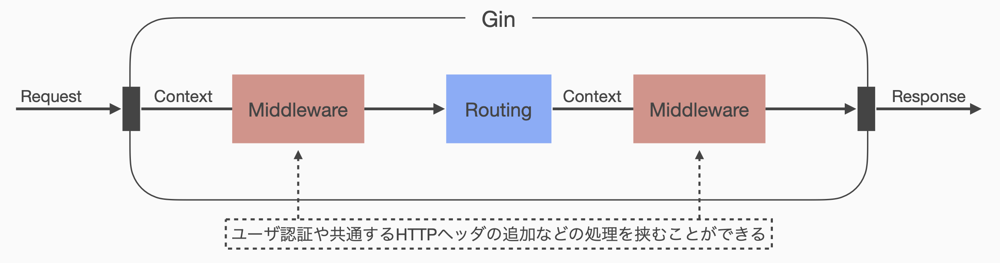

# 03: Webアプリケーションフレームワーク
[前回](02_http_and_routing.md)は，Webアプリケーションを支えるHTTP通信の仕組みや，アプリケーション開発時に使用するであろう基本的なルーティングの方法について扱いました．

今回は以下の内容を通して，開発効率の向上およびユーザとのインタラクションについて扱います．

1. Web Applicaion Framework
2. Hypertext Markup Language (HTML)
3. formタグを用いたHTTP POST

また今回から3回に分けて，新たなプロジェクトをベースとして演習を進めます．
以下のリンクより新しいプロジェクト formapp.go をダウンロードし，演習が進められるよう展開・配置してください．

<https://github.com/cs-sysdes/formapp.go>

ダウンロード方法は [第1回資料](01_preliminary.md) を参照してください．


## Web Application Framework
前回配布したプログラムは基礎的なHTTPサーバ機能しか持たず，ルーティングのために自分でHTTPリクエストを解析したり，適切なHTTPレスポンスを返すようヘッダ情報を追加したりといった処理を自分で実装する必要がありました．
今後，より複雑な機能を持った実用的なWebアプリケーションを開発していくにあたって，こうした処理を開発者自身が毎回行うのは面倒ですし，ミスが起こりやすく非効率的です．

こうしたWebアプリケーション開発において常に必要となる共通処理をまとめたライブラリや，必要に応じて開発を支援する仕組みなどを集めたものを，一般に <b>Web Application Framework (WAF)</b> あるいは単に Web Framework と呼びます．
多くのWAFは適切なHTTPレスポンスを簡単に返すことができる仕組みや，HTMLページの生成を補助する仕組みを持っており，Webアプリケーション開発において面倒な部分を肩代わりしてくれます．

現代のWebアプリケーション開発においてはなにかしらのWAFをベースに開発が行われている場合が多いです．
有名どころでは以下のようなWAFが対応する各プログラミング言語と組合せて実際に使われています．

| WAF     | Language   |
|---------|------------|
| Drogon  | C++        |
| Spring  | Java       |
| Play    | Java,Scala |
| Rails   | Ruby       |
| Laravel | PHP        |
| Phoenix | Elixir     |
| Django  | Python     |

一方で，Go言語 は Google によって開発がすすめられた比較的新しい言語である背景から，Web周りのサポートが他の言語と比べても非常に充実しています．
実際WAFに頼らなくても，標準パッケージ `net/http` だけでも十分にWebアプリケーションの開発が可能です．
Go言語に対応するWAFには `net/http` パッケージに薄い wrapper を追加する程度のものも多く，こういった点からも標準パッケージによるサポートの強さがわかります．

以下ではまず，標準パッケージ `net/http` を用いたHTTPサーバ実装の例を示します，
この例の中で `net/http` の便利さを理解してもらった上で，実は少し使いづらい部分なども紹介し，以降の演習にて扱う Go言語 向けのWAF: [Gin](https://github.com/gin-gonic/gin) を導入します．

### 標準パッケージ `net/http`
`net/http` パッケージを使用して，[前回資料](02_http_and_routing.md) と同様に localhost:8000/ に GET リクエストが来た場合に "Hello world." を表示するWebサーバを構築してみます．
具体的には，以下のようなコードになります．
これは説明の都合上示した例ですので，今回配布した formapp.go 内に以下を実装する必要はありません．

```go
package main

import "net/http"

func main() {
    http.HandleFunc("/", rootHandler)
    http.ListenAndServe(":8000", nil)
}

func rootHandler(w http.ResponseWriter, r *http.Request) {
    if r.URL != "/" {
        w.WriteHeader(http.StatusNotFound)
        return
    }
    if r.Method != "GET" {
        w.WriteHeader(http.StatusMethodNotFound)
        return
    }
    w.Write([]byte("Hello world."))
}
```

<div class="memo">
蛇足ですが，11 行目および 15 行目の条件分岐ですが，こうした場合はおそらく <code class="hljs go">switch</code> を使った方が楽でしょう．
</div>

一見して `main` 関数がすっきりしたことがわかります．
前回配布したプログラムでは，通信を受けるソケットを用意したり，接続を待ち受けたりといった動作をすべて記述していましたが，今回の例ではそうした面倒な記述がすべて 7 行目の `http.ListenAndServe` 関数呼び出しにて済んでいます．

また，`net/http` パッケージはルーティングの機能を<b>パスと対応する処理のペア</b>を登録する形式で提供しています．
6 行目に示す `http.HandleFunc` 関数は引数としてパスと指定された形式のコールバック関数を受け取り，リクエストパスが "/" であるリクエストは `rootHandler` 関数に処理を任せるものとしてルーティング設定を登録します．

コールバック関数として登録される `rootHandler` 関数は，引数として `http.ResponseWriter` および `*http.Request` の 2 つの構造体をとります．

第1引数である `http.ResponseWriter` 型の変数 `w` は，HTTPレスポンスとしてヘッダ情報や BODY を書き込むための変数であり，12 行目や 16 行目のように`http.ResponseWriter.WriteHeader` メソッドによって BODY が空のヘッダ情報だけを返すことができたり，19 行目のように `http.ResponseWriter.Write` メソッドによって BODY を含めたレスポンスを返すことができます．
なお，`http.ResponseWriter.Write` 関数は，引数によって渡された BODY に記述されるべきバイト列から自動で `Content-Length` の値を計算し，HTTP header としてレスポンスに含めてくれます．

第2引数である `*http.Request` 型の変数 `r` は，HTTPリクエストを格納している変数であり，パスやメソッドなどの情報はすでにパースされて構造体のメンバとして保存されています．
前回のプログラムでは自分で `strings.Split` 関数などを用いてメソッドの種類やパスを取得する必要がありましたが，`http.Request` を介することで，`http.Request.Method` や `http.Request.URL` などによってメソッドやパスを直接参照することができるようになっています．

ここまでを見ると，`net/http` パッケージはこれだけでも十分に便利な気がしてきます．
一方で，11 行目の条件分岐について何か違和感がないでしょうか．
6 行目ですでに "/" に対するルーティングとしてパスを検査しているにもかかわらず，再びここでパスを検査しています．
一見すると無意味な条件分岐にも見えますが，実はきちんと意味のある条件分岐です．

6 行目 `http.HandleFunc` 関数の第1引数は，**最長一致** の原則を採用しています．
すなわち，6 行目の設定だけでは，"/" が引っかかるのはもちろんですが "/hello" や "/bye" でも先頭の "/" は一致しているので `rootHandler` 関数が呼び出されてしまいます．
ここでは，"/" だけに限定して "Hello world." を返したいので，11 行目のように正確なパス検査を入れる必要があります．
また，メソッドによる分岐も 15 行目のように `http.Request.Method` を参照して設定する必要があります．

このように `net/http` パッケージは[前回](02_http_and_routing.md)配布した httpserver.go よりは便利ですが，いろいろと足りない部分などがあります．
特に `net/http` パッケージの持つルーティング機能はやや遅い (計算コストが高い) ことが知られており，こうしたちょっとした面倒さやアプリケーションの応答速度などを気にする場合には，さらに別のWAFの使用が検討されます．

### Gin Web Framework
[Gin](https://github.com/gin-gonic/gin) は Go言語 によって記述された代表的WAFの1つです．
基礎的なHTTPサーバ機能として，標準パッケージ `net/http` に代えて [HttpRouter](https://github.com/julienschmidt/httprouter) を使用し，高速に動作するよう設計されています．

Gin を用いて先ほど示した localhost:8000/ へのGETリクエストに対して "Hello world." を返すHTTPサーバを実装した例を以下に示します．
なお，この例は今回配布した formapp.go が持つ main.go ファイルを簡略化したものになっています．

```go
package main

import (
    "net/http"
    "github.com/gin-gonic/gin"  // ginパッケージをimport
)

func main() {
    engine := gin.Default()
    engine.GET("/", rootHandler)
    engine.Run(":8000", nil)
}

func rootHandler(ctx *gin.Context) {
    ctx.String(http.StatusOK, "Hello world.")
}
```

`main` 関数に注目すると，`net/http` パッケージを使用した場合とほとんど変わりません．
ただし 10 行目のように，Gin ではHTTPメソッドを指定したルーティングを記述することができます．
また `net/http` の場合とは異なり，パスとして "/" と指定した場合，これは基本的に "/" にしかマッチしません．
これにより，先ほどのように追加条件をコールバック関数側で記述する必要がなくなるため，"/" へのGETリクエストに対して呼び出されるコールバック関数 `handleRoot` (14--16行目) をかなり簡単に書くことができます．

コールバック関数の形式も先ほどとは異なり，引数として `*gin.Context` 型の変数のみをとる関数になります．
`gin.Context` は，HTTPリクエストとHTTPレスポンスを合わせたような構造体だと理解しておけば良いかと思います．
今回は文字列として "Hello world." を返したいので，15行目のように `gin.Context.String` メソッドを用いてHTTPレスポンスの種類と内容を指定しています．
より具体的に書けば，Content-Type として String = text/plain を指定し，BODYとして "Hello world." を持つHTTPレスポンスを生成します．
当然ながら，Content-Length は自動計算されます．

Gin はこのようにライブラリとして便利な機能を提供するだけではなく，Framework として開発を支援する機能をいくつか提供します．
代表的な機能の一つに Middleware の挿入という機能があり，以下のようにルーティングの前後にアプリケーション全体で共通する処理を挟むこむことができます．
この機能により，たとえばユーザ認証を必要とするアプリケーションではルーティング前に認証処理を挟むことによってルーティング後の特定の処理と全体での共通処理を分離でき，見通しの良いアプリケーションの設計が可能になります．
この演習中に middleware に触れるところまで進めるかはわかりませんが，こういうこともできるということだけ頭の片隅に置いておくとよいでしょう．



Go言語 で記述されたWAFとしては，他にも [Echo](https://github.com/labstack/echo) などが有名ですが，本演習では Gin を扱うこととします．
Echo にも Gin と同様に middleware を扱う仕組みが存在し，全体的な使用感も Gin と大きく差があるわけではありません．

##### 練習問題 3-1
formapp.go/main.go を編集し，[前回資料](02_http_and_routing.md)において示した 練習問題 2-3 の内容を，Gin を用いてプログラムしてみましょう．
具体的には，以下の要求を満たすよう formapp.go/main.go を編集してください．

- Webブラウザから `localhost:8000/hello` にアクセスした場合，"Hello world." が画面に表示される．
- Webブラウザから `localhost:8000/bye` にアクセスした場合，"Good bye." が画面に表示される．
- Webブラウザから `localhost:8000/hello.jp` にアクセスした場合，日本語で "こんにちは" と表示される．

Gin を使用する場合，1つのルーティング (HTTPメソッドとパスの組) に対して対応する1つのコールバック関数を定義する必要があります．
必要に応じてコールバック関数を新たに定義し，ルーティングのルールを追加することで目的の処理を実装することができます．
関数名などは特に指定しませんが，わかりやすい名前を付けると良いでしょう．

## Hypertext Markup Language (HTML)
ここまでのプログラムは文字列を Client-side に返してきました．
したがって，Webブラウザ上に表示される結果も単なる文字列であり，なかなかに質素なものだったと思います．
一方で，たとえばこの演習資料のように，多くのWebページには見出しやリンク，パラグラフなどが存在しています．
ここでは，こうした構造化された文書を Client-side に返す方法について扱います．

Webサイトのように電子デバイス上での閲覧を想定した，複数のテキストを即時利用可能な形式でリンクした文書形式を一般に <b>Hypertext</b> と呼びます．
またこうした Hypertext を記述するための形式言語を <b>Hypertext Markup Language (HTML)</b> と呼び，Webページは通常このHTMLによって記述されます．

HTMLでは文書を原則として木構造で表現し，木構造を構成する節や葉は <b>タグ (tag)</b> によって文書構造中に配置されます．
例としてWebブラウザに "Hello world." とだけ表示するHTMLを以下に示します．
```html
<!DOCTYPE html>
<html>
    <body>
        Hello world.
    </body>
</html>
```

1 行目の `<!DOCTYPE html>` は**文書型宣言**と呼ばれ，これはタグではありません．
ここではこの文書がHTML，より具体的にはHTML5によって書かれていることを宣言しており，HTMLのバージョンによって書き方が少し異なります．
現在ではHTML5を使用するのが標準ですので，他のバージョンの書き方は特に覚えなくてもよいでしょう．

2 行目の `<html>` は，HTML要素と呼ばれる木構造における根の役割を持つ要素の宣言をするタグです．
この `<html>` タグは 6 行目の `</html>` とペアになっており，一般に前者を「開始タグ」，後者を「閉じタグ」などと呼びます．
HTMLにおける節や葉の多くは開始タグと閉じタグのペアで構成され，タグが入れ子 (ネスト)  になっている場合は外側のタグが親，内側のタグが子となる親子関係を表します．
たとえば，3 行目に出現する `<body>` タグは `<html>` タグの子になります．
したがって，このHTMLは `<html>` 要素が根であり，唯一の葉として `<body>` 要素を持つ木構造であることがわかります．
注意点として，HTMLには一部単独で存在することのできるタグがあり，こうしたタグは基本的に子要素を持たないため，木構造における節になることがありません．

`<body>` はBody要素と呼ばれ，Webブラウザが画面上に表示する文書パーツを表します．
このHTMLはBody要素内にプレーンテキストで "Hello world." だけを持つので，Webブラウザ上に "Hello world." と表示するだけのものとなります．
HTMLは基本的にインデントを無視するので，"Hello world." の前に余計なスペースが入ることはありません (インデントを含めて見た目通り出力する方法もあります)．

多くの場合HTML文書にはBody要素のほかにHead要素と呼ばれるパーツが配置され，たとえば以下のような形式をしています．
```html
<!DOCTYPE html>
<html>
    <head>
        <title>formapp.go</title>
    </head>
    <body>
        Hello world.
    </body>
</html>
```

`<head>` タグによってHTML要素直下に配置されるHead要素は，通常そのままWebブラウザ上に表示されることはありません．
Head要素はそのページを構成するメタ情報などを記載する場所とされており，たとえば 4 行目の `<title>` タグはWebブラウザのタブ上などに表示するWebページのタイトルを設定するための記述です．
この他にも，ページ全体の文字コードの指定や関連する外部ファイルの取り込みに関する情報が記載されている場合が多いです．

試しにこの演習資料のHTMLソースコードを眺めてみると良いかもしれません．
Webブラウザによって方法が異なりますが，だいたいの場合ページ上で右クリックをすると出現するメニュー内に「このページのソースを表示」などの項目があると思います．
割と複雑なHTMLが表示されますが，当然すべて教員が心を込めて手入力した温もりあるHTMLというわけではありません．
一部実際に手動入力している部分もありますが，ほとんど自動生成です．

HTMLで使用できるタグには様々な種類があり，それぞれ特定の用途が定められています．
なかには文書中における役割を明示するタグなどもあり，こうしたタグを適切に使用することで文書に対して意味的な構造を与えることも可能です．
詳細は [HTML | w3schools.com](https://w3schools.com/html/default.asp) などを参考に各自で学習を進めて下さい．

WebブラウザはこうしたHTML文書を解析し，画面上に描画する機能をもったアプリケーションです．
しかしながら，HTMLの機能だけでは人間に優しい表示を制御することは難しいので，JavaScript や CSS などを併用してより可読性が高く使いやすいWebページにできるよう開発者が努力しています．

### GinでHTMLを返す
それではこれまで無機質な文字列だけを返していたプログラムを編集し，HTMLを返してみます．
とりあえず，HTMLを文字列として直接プログラム中に埋め込めば目的は達成できそうです．
```go
func rootHandler(ctx *gin.Context) {
    ctx.String(http.StatusOK, "<!DOCTYPE html><html>...")
}
```

この方法には明らかな問題があります．
`gin.Context.String` メソッドは HTTP header に `Content-Type: text/plain` を設定してしまうため，WebブラウザによってはHTML文書ではなく単なるプレーンテキストとして認識されてしまい，正しく描画されないことがあります．
正しいレスポンスとして設定されるべきは `Content-Type: text/html` です．
また，HTMLを文字列として書くとシンタックスハイライトも効かないし書くの怠いですよね．
Content-Type を変更する方法はいくつか存在しますが，もっと良い方法があればそちらを使いたいです．

より良さそうな方法として，返したいHTML文書を別ファイルで用意し，そのファイルをプログラム中で読み込んでHTTPレスポンスとして返す方法を考えます．
formapp.go/templates の中に，すでにいくつかのサンプルHTML文書を配置していますので，これを使いましょう．
たとえば以下のような形式になると良さそうです．
```go
// このコードは嘘のコードです
func rootHandler(ctx *gin.Context) {
    html := file.Read("templates/hello.html")
    ctx.String(http.StatusOK, html)
}
```

先ほどよりは筋がよさそうですが，Gin は Web Framework としてもっと良い方法を提供しています．
以下のコードでは `package main` などの共通部分を省略しています．
```go
func main() {
    engine := gin.Default()
    engine.LoadHTMLGlob("templates/*.html")
    engine.GET("/", rootHandler)
    engine.Run(":8000", nil)
}

func rootHandler(ctx *gin.Context) {
    ctx.HTML(http.StatusOK, "hello.html", nil)
}
```

重要な変更点は 3 行目 `engine.LoadHTMLGlob("templates/*.html")` および 9 行目 `ctx.HTML(http.StatusOK, "hello.html", nil)` の2点です．

9 行目のHTTPレスポンスを設定している部分から説明します．
先ほどまでのプログラムでは，`gin.Context.String` メソッドを使用して `Content-Type: text/plain` となる文字列データをHTTPレスポンスに設定していました．
一方今回は，`gin.Context.HTML` メソッドを使用することで，`Content-Type: text/html` となるHTML文書をレスポンスに設定しています．
`gin.Context.HTML` メソッドは，第1引数としてHTTPステータスコード，第2引数として返すHTML文書のファイル名を取ります．
第3引数は今回使用しないので `nil` を渡しています．
このメソッドは第1引数で渡されたHTTPステータスコードをともなって，第2引数で渡されたファイルに従って生成したHTML文書をHTTPレスポンスとして返します．
すなわち，先ほど紹介したファイルを読み込んで返すという動作ができているということになります．

`gin.Context.HTML` ではファイル名を渡しましたが，このファイル名から当該ファイルを見つけるための設定が 3 行目の `engine.LoadHTMLGlob("templates/*.html")` になります．
この関数は templates ディレクトリ内のHTMLファイルをアプリケーションに登録し，ファイル名からの検索対象に含めるために呼び出しています．
すなわち，ここで登録したファイルであれば `gin.Context.HTML` メソッドからファイル名によって使用することができるということです．

この方法は Gin Web Framework 特有の方法ですが，他のFrameworkでも同様の方法が提供されていることが多いと思われます．

##### 練習問題 3-2
練習問題 3-1 の内容を，それぞれ対応するHTMLファイルを作成したうえで，`gin.Context.HTML` メソッドによってHTML文書を返す方法に書き変えてみましょう．

## formタグを用いたHTTP POST
Server-side から Client-side へHTML文書を送ることができるようになったので，今度は逆に Client-side から何かしらの入力情報を Server-side に送ってみます．
こうした情報送信にはHTMLタグの一つである `form` タグが使用できます．
`form` タグの使い方を見るため，プログラムに少し修正を加えます．

`main` 関数内に以下のルーティングを登録してください．
```go
engine.GET("/name-form", nameFormHandler)
engine.POST("/register-name", registerNameHandler)
```

また，以下の関数をファイル内に定義してください．
```go
func nameFormHandler(ctx *gin.Context) {
    ctx.HTML(http.StatusOK, "name_form.html", nil)
}

func registerNameHandler(ctx *gin.Context) {
    body, _ := ctx.GetRawData()
    ctx.String(http.StatusOK, string(body))
}
```

Webブラウザから localhost:8000/name-form にアクセスすると，以下のような入力画面が表示されるはずです．
入力欄に適当な名前を入力後，送信ボタンを押してどうなるか観察してみましょう．
このとき，入力として英数字のみを入れた場合と，漢字やひらがな，スペース (空白文字) などを含めた場合とで結果に違いが出るか確認してください．

例として，入力欄に「東工大」といれて送信した場合，次の画面に以下のような表示が出ると思います．
```
name=%E6%9D%B1%E5%B7%A5%E5%A4%A7
```
これについて次の節で説明します．

### Content-Type: application/x-www-form-urlencoded
`form`タグから送られたデータは，基本的に `key=value&key2=value2&...` という形式でサーバへ送信されます．
今回の例では，`form` タグから `name` という key で入力値を送っているため，`name=<入力値>` という形でサーバへ情報が送られてきます．

このとき，HTTPではURLなどの文字列において，たとえばスペースや「@」などの通常使用できない文字が存在します．
こうした文字は通信可能な形式に変換 (encode) された上で送信されるため，正しく解釈するには受信側で逆変換 (decode) してやる必要があります．
日本語のようなマルチバイト文字は基本的に`%..`のような形式に変換されるため，「東工大」と入力したものをそのまま表示しようとすると怪しい文字列になるわけです．

逆変換のためには，たとえば Java では `java.net.URLDecoder` というクラスなどが用意されていますが，Go言語ではより扱いを簡単にするために，`gin.Context` のメソッドとして指定した key に対応する value を自動的に逆変換して返す `GetPostForm` メソッドが存在します．
したがって，`registerNameHandler` 関数を以下のように書き変えると適切な表示に変換されるはずです．
```go
func registerNameHandler(ctx *gin.Context) {
    name, _ := ctx.GetPostForm("name")
    ctx.String(http.StatusOK, name)
}
```

このメソッドが存在することによって，`key1=value1&key2=value2&key3=value3` などのような情報が送られてきた場合でも，"&" で分割して decode して...などとしなくても簡単に目的の値を取り出すことができます．
なお，`gin.Context.GetPostForm` メソッドは，指定した key が存在しない場合に第2戻り値として `false` を返すため，これを使用して key の存在判定を行うことができます．

### HTMLへの値の埋め込み
`registerNameHandler` は送られてきた入力値を文字列で返しているだけなので，これをHTMLで返すように変更しましょう．
Go言語のHTMLテンプレート機能には，HTMLファイル中に変数の値などを埋め込む機能があるため，これを使用してHTML文書中に送信されてきた名前情報を入れてみます．

templates/result.html は以下のようなHTML文書 (のテンプレート) になっています．
```html
<!DOCTYPE html>
<html>
    <head>
        <title>Result | formapp.go</title>
    </head>
    <body>
        <h1>入力結果</h1>
        <dl>
            <dt>名前</dt>
            <dd>{{ .Name }}</dd>
        </dl>
    </body>
</html>
```

詳しい構造の説明は省略しますが，10 行目に見慣れない表現 `{{ .Name }}` があります．
これはHTML文書中に変数の値を埋め込むための構文です．
このHTMLテンプレートを使用して，入力結果をHTMLで返す `registerNameHandler` 関数の例を以下に示します．
```go
func registerNameHandler(ctx *gin.Context) {
    name, _ := ctx.GetPostForm("name")
    ctx.HTML(http.StatusOK, "result.html", gin.H{"Name": name})
}
```

基本的には "Hello world." を表示したときの例と同じですが，`gin.Context.HTML` の第3引数として `nil` ではなく `gin.H{"Name": name}` を渡しています．
`gin.H` 関数は単純な連想配列 (HashMap) を提供する関数で，ここでは "Name" という key に変数 `name` の値を紐づけています．
key と指定される "Name" は templates/result.html 中の `{{ .Name }}` と同じである必要があります．
すなわち，`{{ .Name }}` は渡された連想配列から key として "Name" に対応する値を受け取り，その場に展開するコードとして働きます．

簡単ですが，これで Client-side から Server-side への情報送信およびHTMLの整形方法を扱ったことになります．

##### 練習問題 3-3
`<form>` タグでは `action` 属性で送信先，`method` 属性でHTTPリクエストメソッドの種類を指定できます．
では，いま `action="POST"` となっている場所を `action="GET"` とした場合，どういった変化が起こるか，確認してみてください．

## まとめ
今回はより実践的なWebアプリケーション開発のためのフレームワークについて扱いました．
また，HTMLを返すことでWebページとして表示できるようにし，同時に Client-side から Server-side へ情報を送信する方法を扱いました．

次回から2回に分けて，通信ごとに情報を記憶しておく方法を扱います．
HTTP通信は基本的に記憶を持たないため，前回の通信時にどういった状態であったかという情報を次の通信時まで保持するためには工夫が必要です．
この工夫として2種類の方法を2回に分けて扱います．

次回以降も formapp.go を使用しますので，削除しないよう気を付けてください．

今回の内容は以上になります．
お疲れさまでした．
