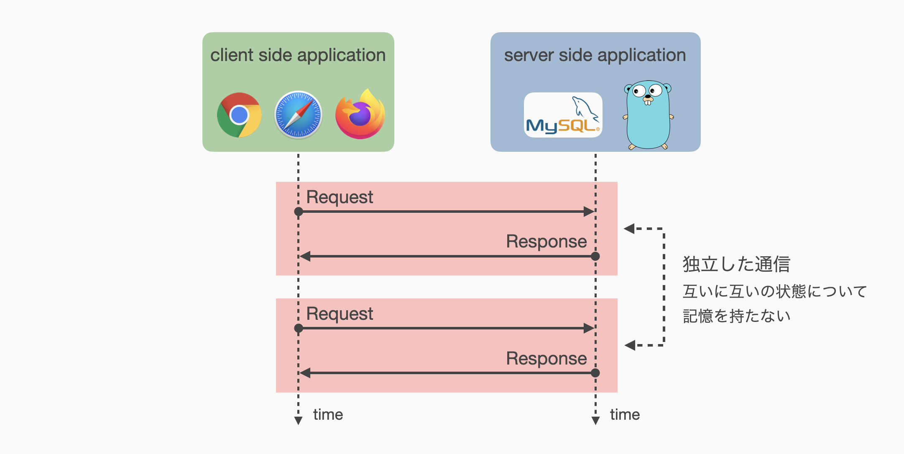
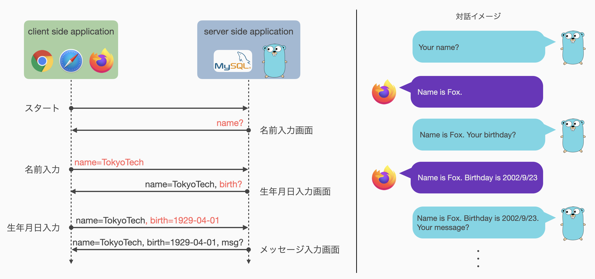

# 04: HTTP通信における状態管理 (1)
[前回](03_web_application_framework.md)は，より効率的にWebアプリケーション開発を進める仕組みとしてWeb Application Frame について扱いました．
基礎編最後の2回は，実践的なWebアプリケーション開発のために必要な状態管理について扱います．

内容に入る前に，今回開発するアプリケーション formapp.go の仕様を以下のリンクより確認してください．

仕様書：<https://cs-sysdes.github.io/formapp.html>

仕様書に示す通り，formapp.go は 5 つの画面からなるアプリケーションです．
本来であれば 1 画面でまとめてすべての情報を入力できる程度のものですが，練習のため個別の入力画面としています．
示された仕様から，formapp.go は **5.確認画面** において **1～4 の画面において入力した情報を参照**する必要があることがわかります．

**04: 状態管理 (1)** および **05: 状態管理 (2)** では，この挙動を実現する上で解決しなければいけない状態管理に関する課題を説明し，その解決方法を実装します．
なお，ここで**状態**とはユーザのログイン状態やリクエストに関する一時的な記憶など，比較的短時間で変化し得るものを仮定しています．

今回は特に以下の内容を通して状態管理に関する課題を理解し，1 つ目の解決方法を実装していきます．
1. 事前準備: パッケージ分割
2. HTTP通信のステートレス性
3. 状態管理手法 (1): ステートレス方式

引き続き formapp.go をベースプロジェクトとして使用します．
前回の練習問題などにおいてすでに修正を加えているかと思いますが，初期状態に戻す必要はありません．
複数機能の開発を行うため，まずは Go言語 におけるパッケージ分割 (ソースコード分割) の方法について説明し，状態管理のための準備を整えます．

これ以降，提示するコードに関して以下に注意してください．
- package 宣言を省略するなど，ソースコードの一部を抜粋している場合があります．
- 表記中の `...` はコードの省略を意味します．
- 提示したコードの n 行目などと指定した場合は，本資料上での行数を意味しています．
  多くの場合，実際のソースコード上での行数と一致するものではありません．


## 事前準備: パッケージ分割
これから複数の機能を実装していくにあたり，すべてを formapp.go/main.go の中に記述していると，プログラム全体の見通しが悪くなりミスを発見しづらくなるなど，あまり良いことはありません．
C言語 や Java，その他の言語を用いる場合においても，ある程度の規模になるとソースコードを機能や役割ごとに分割し，プログラムの構造を整理する必要が生じます．
ここでは Go言語 においてソースコード分割 (パッケージ分割) の方法を簡単に説明し，以降の演習に備えます．

いま formapp.go/main.go が以下の状態であると仮定して話を進めます．
各自で修正した部分がある場合でも，元に戻す必要はありません．
現在の手元のソースコードの状態と読み換えて資料を進めてください．

<span class="filename">formapp.go/main.go</span>
```go
func main() {
    ...
    engine.GET("/", rootHandler)
    ...
}

func rootHandler(ctx *gin.Context) {
    ...
}
```
ここでは `rootHandler` 関数を `service` パッケージに分割することにします．
前回の練習課題などで他にも定義した関数があれば，それらもついでに移動しましょう．

### service パッケージへの関数定義の移動
ディレクトリ名がパッケージ名となるので，まず formapp.go/service というディレクトリを作成します．
また，作成したディレクトリ下に適当な名前を付けたGo言語ソースファイルを配置します．
ここでは formapp.go/service/handler.go とでもしておきましょう．
ファイル名は基本的にパッケージの import などに影響を与えないため，わかりやすい名前であれば特に制限はありません．

作成したソースファイルにプログラムを書き込みます．

<span class="filename">formapp.go/service/handler.go</span>
```go
package service

import (
    "github.com/gin-gonic/gin"
)

func RootHandler(ctx *gin.Context) {
    ...
}
```

1行目のパッケージ宣言は，このファイルが属するパッケージ名として `service` を宣言しています．
パッケージ宣言は直上のディレクトリ名のみを宣言し，Java のようにすべてのパッケージ階層を宣言する必要はありません．

コールバック関数作成時に Gin によって提供される構造体 `gin.Context` を使用するため，Gin のパッケージを import します．
他にも関数内で使用するパッケージがある場合には，ここで明示的に import する必要があります．
たとえば標準パッケージ `fmt` を使用する場合，たとえ main.go 内で `fmt` を import していても，こちらのファイルには適用されないので，ここで再度 import する必要があります．

7行目において関数 `RootHandler` を定義しています．
[第1回](01_preliminary.md)でも触れたように，Go言語では**識別子の先頭が大文字の場合のみ他のパッケージから可視**であるため，`rootHandler` ではなく `RootHandler` とする必要があります．

さて，関数定義を新たなパッケージ `service` へ移動したので，main.go の方も手直しが必要です．

### service パッケージの利用
`main` パッケージから `service` パッケージを利用するには，これを import する必要があります．
また，ルーティング時に指定するコールバック関数も，`service` パッケージにより提供されるものに変更しなくてはいけません．

修正後の formapp.go/main.go を以下に示します．
主な変更点は 8 行目と 13 行目です．

<span class="filename">formapp.go/main.go</span>
```go
package main

import (
    "fmt"
    "net/http"

    "github.com/gin-gonic/gin"
    "formapp.go/service"
)

func main() {
    ...
    engine.GET("/", service.RootHandler)
    ...
}

// rootHandler関数の定義はserviceパッケージへ移動済み
```

8行目において先ほど作成した `service` パッケージを import し，使用可能にしています．
Go言語では，C言語のように `import "./service"` などとして import することができません．
標準パッケージ以外のパッケージを使用する場合，必ず**モジュール名から使用するパッケージ名までのパスを記述**する必要があります．
今回の場合モジュール名は `formapp.go` ですので，import 文には "formapp.go/service" を指定しています．
なお，モジュール名は formapp.go/go.mod の1行目に `mod formapp.go` として宣言しています．

13行目において "/" への GET アクセスに対し `service.RootHandler` を呼び出すルーティング設定をしています．
`RootHandler` 関数は `service` パッケージ内の関数なので，このように指定する必要があります．

<div class="memo">
github.com/gin-gonic/gin はモジュール名ですが，パッケージ名は gin です．
github.com/gin-gonic の部分は GitHub 上でのユーザディレクトリのようなものなので，実質的にモジュールのルートディレクトリは gin になります．
Go言語ではこのようにモジュールルートもパッケージになります．
一方で，パッケージ名として '.' (ドット) は使用できない文字なので，本演習のようにルートディレクトリとして formapp.go などと名前を付けてしまうと，そのままパッケージ名として採用できなくなります．
</div>

パッケージ分割の方法がわかったところで，今回のメイントピックである状態管理について見ていきます．


## HTTP通信のステートレス性
WebアプリケーションはHTTP通信によって Client-side と Server-side が情報をやり取りし，目的のタスクを実行するアプリケーションです．
したがって，WebアプリケーションはHTTP通信の持つ制限や制約に縛られます．
HTTP通信が持つ制約の中でも，Webアプリケーション開発において大きな課題となるのが，**ステートレス性**という性質です．

HTTP通信のステートレス性とは，簡単に言えば**個々の通信でやりとりした情報や状態は何もしなければ次の通信に引き継がれない**という性質です．



いま作成したい formapp.go の仕様で考えると，この性質によって「1. 名前入力画面」で入力された情報は**アプリケーションが何もしなければ**次の「2. 生年月日入力画面」へは引き継がれず，最終的に「5. 確認画面」で表示することもできません．
すなわち，HTTP通信自体はこうした情報を自動で保持する仕組みはなく，**アプリケーションの責任**において保持しなければいけないということになります．

Webアプリケーションにおける状態管理とは，1つのリクエストと1つのレスポンスの対からなる通信について，**複数の通信間で状態 (情報) を引き継ぐ**ことを意味します．
複数の通信間で状態を引き継ぐためには，**どこかに引き継ぎたい状態を保存**しておき，**通信のたびに保存していた状態を確認**することができれば良いでしょう．

このとき，どこに状態を保存するかによって大きく2つの方式を考えることができます．
これらの方式を，本演習では「**ステートレス方式**」および「**セッション方式**」と呼ぶこととします．

両方式の違いを以下に簡単にまとめます．

<div class="table-wrapper">
<table style="width: 100%">
    <thead>
        <tr>
            <th style="width: 40%">ステートレス方式</th>
            <th style="width: 20%"></th>
            <th style="width: 40%">セッション方式</th>
        </tr>
    </thead>
    <tbody>
        <tr>
            <td style="width: 40%">通信上に載せる</td>
            <td style="width: 20%; text-align: center">状態の保存</td>
            <td style="width: 40%">Server-side アプリケーションが記憶</td>
        </tr>
        <tr>
            <td style="width: 40%">Server が状態を記憶する必要がなく，通信相手を区別する仕組みも不要</td>
            <td style="width: 20%; text-align: center">利点</td>
            <td style="width: 40%">通信量が扱う状態のデータサイズに依存しにくい</td>
        </tr>
        <tr>
            <td style="width: 40%">扱う状態のデータサイズに依存して通信料が増える</td>
            <td style="width: 20%; text-align: center">欠点</td>
            <td style="width: 40%">複数 Client からの並行アクセスに対し通信相手を弁別する仕組みが必要</td>
        </tr>
    </tbody>
</table>
</div>

<div class="memo">
「ステートレス方式」および「セッション方式」という名称は便宜上のものであり，一般的な呼称ではないことに注意．
</div>

今回は特に「ステートレス方式」について実装を進め，次回「セッション方式」を扱います．

## 状態管理手法 (1): ステートレス方式
ステートレス方式は，Server-side アプリケーションが状態を持たない (= ステートレス) ことから，このような名称を便宜上与えています．
Server-side アプリケーションが情報を持たない代わりに，ステートレス方式では毎回の通信にこれまでのすべての状態を載せることで，複数の通信間での状態の引き継ぎを実現しています．

formapp.go におけるステートレス方式を図示すると以下のようになります．



図中に示すように，各通信に前の通信で得た情報を毎回しつこく載せ続けることによって，Server-side が記憶を持っていなくとも，**通信の内容を見ればすべての状態を把握可能**な仕組みを作ることができます．

それでは実際にステートレス方式で formapp.go を実装してみましょう．

### 仮ルーティングの設定
はじめに formapp.go/main.go 内にルーティングのみ先に定義してしまいましょう．
formapp.go の仕様において最低限必要なルーティング設定は以下の 5 つです．

- スタート画面を表示 (GET) するルート
- スタート画面からのPOSTを受け取るルート
- 名前入力画面からのPOSTと受け取るルート
- 生年月日入力画面からのPOSTを受け取るルート
- メッセージ入力画面からのPOSTを受け取るルート

ここで，名前入力画面，生年月日入力画面，メッセージ入力画面，確認画面を表示するルートは不要である点に注意してください．
これらの画面は，前の画面からのPOSTリクエストに対するレスポンスとして返すことができるため，別途GETメソッドによるアクセスを考える必要がありません．
また，確認画面からスタート画面に戻る際は，form タグでスタート画面への GET メソッドを送信するか，単にリンクとすることで対応可能です．

これらのルーティングを先に設定してしまいましょう．

<span class="filename">formapp.go/main.go</span>
```go
func main() {
    ...
    engine.GET("/stateless/start", notImplemented)
    engine.POST("/stateless/start", notImplemented)
    engine.POST("/stateless/name", notImplemented)
    engine.POST("/stateless/birthday", notImplemented)
    engine.POST("/stateless/message", notImplemented)
    ...
}

func notImplemented(ctx *gin.Context) {
    msg := fmt.Sprintf("%s to %s is not implemented yet", ctx.Request.Method, ctx.Request.URL)
    ctx.String(http.StatusNotImplemented, msg)
}
```

ルーティングを設定する際，10行目のような未実装であることを通知するだけの関数などを仮配置しておくと便利です．

### スタート画面
仕様書に従って 1. スタート画面 を作成します．
この画面はステートレス方式とセッション方式でほとんど共通ですので，templates/start.html などとして以下のボタンを設置したページを配置します．
なお，`<body>` タグなどは省略していますので，各自で適宜記述してください．

<span class="filename">formapp.go/templates/start.html</span>
```html
<form action="{{ .Target }}" method="post">
    <label>アンケート開始</label><br>
    <input type="submit" value="start"></input>
</form>
```

ここで，1行目において `action="{{ .Target }}"` としてPOST先を変更できるようにしています．
こうすることで，ステートレス方式でもセッション方式でも，このテンプレートを使い回せるようにしています．

次にスタート画面へのGETアクセスを受ける関数を作成します．

ここからステートレス方式の実装を進めるにあたり，次回セッション方式を実装する際と関数名の衝突が発生しないよう新しいパッケージを作成しておきます．
ここでは先ほど作成した formapp.go/service ディレクトリの下に stateless ディレクトリを作成し，`stateless` パッケージとして機能を実装していくこととします．

Go言語 のソースファイルとして先ほど作成した stateless ディレクトリに適当な名前のファイルを作成します．
ここでは formapp.go/service/stateless/handler.go としておきましょう．

<span class="filename">formapp.go/service/stateless/handler.go</span>
```go
package stateless

import (
    "net/http"
    "github.com/gin-gonic/gin"
)

func Start(ctx *gin.Context) {
    ctx.HTML(http.StatusOK, "start.html", gin.H{ "Target": "/stateless/start" })
}
```

ここではスタート画面における POST 先を /stateless/start としています．

formapp.go/main.go を修正し，スタート画面への GET リクエストを飛ばせるようにしてみましょう．

<span class="filename">formapp.go/main.go</span>
```go
import (
    ...
    "formapp.go/service/stateless"  // statelessパッケージを使用
)
func main() {
    ...
    engine.GET("/stateless/start", stateless.Start)
    engine.POST("/stateless/start", notImplemented)
    ...
}
```

3 行目の記述によって，`stateless` パッケージを呼び出せるようにしています．
`stateless` パッケージ内の関数などを使用する場合は，Javaのように `service.stateless.Start` とするのではなく，単に `stateless.Start` で呼び出すことができます (7行目参照)．
このルールでは別々のモジュールで定義された同じパッケージ名で衝突が容易に発生するように思いますが，Go言語では import 時にパッケージに別名をつけることができるため，それほど問題にはなりません．

アプリケーションを起動し，Web ブラウザから http://localhost:8000/stateless/start へアクセスしてみましょう．
スタート画面が表示されれば成功です．

### 名前入力画面
ここではまだ前のページから引き継ぐべき状態がありません．
したがって，スタート画面と同様にセッション方式でも使用できるよう名前入力画面を作成します．

<span class="filename">formapp.go/templates/name-form.html</span>
```html
<form action="{{ .Target }}" method="post">
    <label>名前: </label>
    <input type="text" name="name"></input>
    <br>
    <input type="submit" value="next"><input>
</form>
```

関数を追加します．
少しわかりづらいですが，ここはスタート画面からの POST を受け取って名前入力画面を返す部分なので，まだ特に情報は送られてきません．
`Target` の設定に注意してください．

<span class="filename">formapp.go/service/stateless/handler.go</span>
```go
...

func NameForm(ctx *gin.Context) {
    ctx.HTML(http.StatusOK, "name-form.html", gin.H{ "Target": "/stateless/name" })
}
```

ルーティングも更新します．

<span class="filename">formapp.go/main.go</span>
```go
func main() {
    ...
    engine.POST("/stateless/start", stateless.NameForm)
    ...
}
```

ここでも一度，動作確認をしてみましょう．

### 生年月日入力画面
ここからは前の画面で入力した情報を状態として引き継いでいく必要があります．

まずはこれまで通り素直に生年月日入力画面を作ってみましょう．
ただし，ここからはセッション方式とやや記述内容が異なってくるため，区別できるようなファイル名としておきます．

<span class="filename">templates/stateless-birthday-form.html</span>
```html
<form action="/stateless/birthday" method="post">
    <label>生年月日: </label>
    <input type="date" name="birthday" value="2011-10-22"></input>
    <br><input type="submit"></input>
</form>
```

`input[type=date]` は日付を扱うための input タグです．
また，一般に input タグは `value="..."` とすることで初期値を設定でき，`input[type=date]` の場合は `"2011-10-22"` と記述しておくと 2022年10月22日 が初期値として設定されます．

さて，ステートレス方式では通信に状態を載せるのですが，このままでは名前情報を載せておく場所がありません．
状態を引き継ぐためには状態を載せる場所を確保する必要があるため，その場所を `input[type=hidden]` タグによってつくります．
上記のテンプレートファイルを以下のように修正します．

<span class="filename">templates/stateless-birthday-form.html</span>
```html
<form action="/stateless/birthday" method="post">
    <label>生年月日: </label>
    <input type="date" name="birthday" value="2011-10-22"></input>
    <input type="hidden" name="name" value="{{ .Name }}">
    <br><input type="submit"></input>
</form>
```

変更点は 4 行目です．
この記述により，生年月日入力画面に名前情報を埋め込むことができました．
`input[type=hidden]` は，HTML における通常の input タグのように情報を送信することができますが，Webブラウザ上には表示されません．
したがって，このように通信に情報を載せるための手段として活用することができます．

名前入力を受け取り，生年月日入力フォームを返す関数を formapp.go/service/stateless/handler.go へ追加します．
この関数は /stateless/name への POST を受け取って生年月日入力画面を返す関数なので，以下の 2 つのタスクを実行します．

1. リクエストから名前情報を抜き出す
2. 名前情報を埋め込んだ生年月日入力画面を返す

<span class="filename">formapp.go/service/stateless/handler.go</span>
```go
...

func BirthdayForm(ctx *gin.Context) {
    name, exist := ctx.GetPostForm("name")
    if !exist {
        ctx.String(http.StatusBadRequest, "parameter 'name' is not provided")
        return
    }
    ctx.HTML(http.StatusOK, "stateless-birthday-form.html", gin.H{ "Name": name })
}
```

念のためエラー処理 (5--8行目) を挟んでいますが，本質的には POST されたデータから名前情報を抜き取り，templates/stateless-birthday-form.html に埋め込んで Client へ返すという動作を実行するものです．

ルーティングを更新します．

<span class="filename">formapp.go/main.go</span>
```go
func main() {
    ...
    engine.POST("/stateless/name", stateless.BirthdayForm)
    ...
}
```

ここまでの動作確認を行いましょう．
前述の通り `input[type=hidden]` は通常 Webブラウザ 上では表示されません．
たしかに名前情報が状態として埋め込まれていることを確認するには，HTMLソースを確認する必要があります．
多くの Webブラウザ では，右クリックで出現するメニューから「ページのソースを表示」などの項目を選択することで，HTMLソースを確認することができます．

基本的にはこれを繰り返すだけですので，ステートレス方式での残りのページの実装は練習問題とします．
注意点として，生年月日入力画面では名前情報のみを引き継ぎましたが，メッセージ入力画面では当然ながら名前情報と生年月日情報の2つを引き継がなければなりません．
すなわち，メッセージ入力画面では `input[type=hidden]` フィールドが2つ存在することとなります．

このようにステートレス方式は，扱う情報が増えると情報を引き継ぐためのフィールドが増加し，結果として通信量が増える性質を持っています．
小さなデータを少しだけ引き継ぐ場合には問題にはなりませんが，大きなデータや大量のデータを引き継ぐには不向きだと言えます．

##### 練習問題 4-1
ここまでの内容をもとに，[formapp.goの仕様](https://cs-sysdes.github.io/formapp.html)を満たすアプリケーションを開発してみましょう．
なお，複数行の文字列入力欄は `<textarea>` タグを使うことで実現できます．

##### 練習問題 4-2
追加機能として，各画面に一つ前の画面に戻る「back」ボタンを実装し，前画面での入力を修正できるようにしてみましょう．


## まとめ
今回はWebアプリケーションにおける状態管理について，HTTP通信の制約からくる課題とその解決方法の一つとして「ステートレス方式」を扱いました．
次回は，もう一つの方法である「セッション方式」について扱います．

今回の内容は以上になります．
おつかれさまでした．
