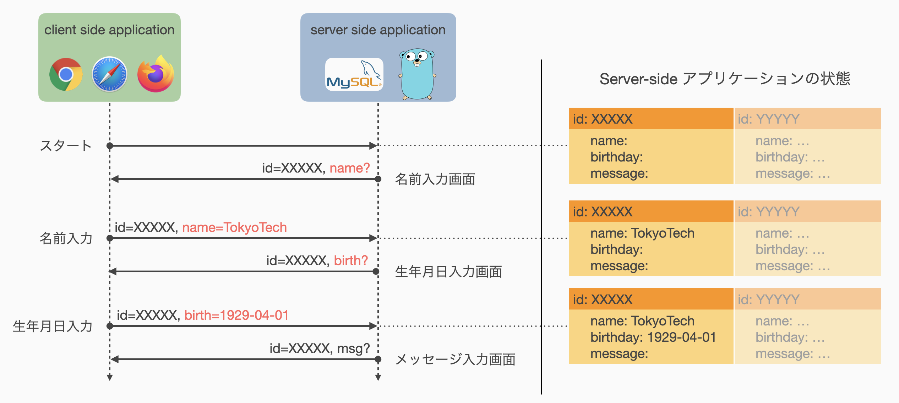

# 05: HTTP通信における状態管理 (2)
[前回](04_state_management_v1.md)に引き続いてHTTP通信における状態管理の方法を扱います．

前回扱った[ステートレス方式](04_state_management_v1.html#状態管理手法-1-ステートレス方式)では，毎回の通信にすべての情報を載せることで，Server-sideアプリケーションに状態を記憶する機能を追加せずに，複数の通信間で状態を管理することができました．
一方で，通信にまたがって管理すべき状態の大きさに依存して通信量が増加するという欠点があり，これはアプリケーションの応答時間を増加させるなどユーザにとって好ましくない動作の原因にもなり得ます．

今回扱うセッション方式では，Server-side アプリケーションが状態を記憶することを許容します．
Server-side アプリケーションは当然ながら複数の Client-side アプリケーション (ユーザ) からのアクセスを同時に受けるため，自身の記憶している状態がどのアクセスに対応した状態であるのかを区別する必要があります．
そのための仕組みの理解と実装が今回の演習内容になります．

今回の流れは以下の通りです．

1. [セッション管理](#セッション管理)
2. [状態管理手法 (2): セッション方式](#状態管理手法-2-セッション方式)

引き続き formapp.go を演習素材として使用します．
前回実装したステートレス方式とは別にセッション方式を実装しますので，プロジェクトを初期化する必要はありません．


## セッション管理
[第2回資料](02_http_and_routing.html#webアプリケーションの基本的な動作)より，HTTP通信を用いたWebアプリケーションは以下の流れで処理を進めます．

1. Client-side アプリケーションが Server-side アプリケーションとの (TCP) 接続を確立する．
2. Client-side アプリケーションから Server-side アプリケーションへ**リクエスト**を送信する．
3. Server-side アプリケーションはリクエストを処理し，Client-side アプリケーションへ**レスポンス**を送信する．

この一連の Client-Server 間の通信の流れを一般に**HTTPセッション**と呼び，HTTPのステートレス性とはHTTPセッションの独立性を意味しています．
アプリケーションが何もしなければ，複数の相異なるユーザからのアクセスは当然独立した相異なるセッションとしてみなされますが，同一ユーザからの複数のアクセスもすべて独立した相異なるセッションとなるわけです．

Server-side アプリケーション上で状態を管理する場合，それぞれの状態がどのセッションに結びついたものであるのかを識別できる必要があります．
ここではとりあえず，それぞれのセッションがどの Client との間に張られたものであるのかを識別できれば，Client 毎の状態を Server-side で個別に管理できそうです．
すなわち，特定のユーザからのアクセスを識別できれば，各ユーザとユーザが入力した内容の紐づけができるでしょう，ということです．



このセッションと状態の紐づけを行うために，Client-side アプリケーションと Server-side アプリケーションとの間で**合言葉**のようなものを決めておけば，Server-side アプリケーションは合言葉のマッチングによって通信相手の同一性を確認できます．
この合言葉を一般に **セッション ID** あるいは **セッションキー** などと呼びます．

Client-Server 間でセッション ID を共有する方法として，1) URL書き換えを使用する方法，2) Cookie を使用する方法，が一般的に使用されます．
両手法の概要を以下に示しますが，本演習では 2) Cookie を使用する方法 を主に扱います．

### URL書き換えを使用したセッションIDの保存
セッション ID を URL 上にパラメータとして載せる，あるいはパスの一部として載せることによって Client-side から Server-side へセッション識別情報を送る方法です．
次に示す Cookie が有効化されていない，あるいは法令的に使用できないケースでもセッション管理を行うことができます．

本演習では詳細を扱わず，こうした方法もあるという程度の紹介にとどめます．

### Cookieを使用したセッションIDの保存
[Cookie](https://developer.mozilla.org/docs/Web/HTTP/Cookies) と呼ばれる小容量データを Client-side アプリケーションに保存し，HTTP Request header を使って Server-side にセッションを識別するための情報を送る方法です．

Cookie は Server-side アプリケーションからの HTTP Response header に `Set-Cookies: key=value` のような形式で指定される Cookie 情報の設定指令によって有効化されます．
これを受け取った Client-side アプリケーションは次の通信から HTTP Request header に `Cookie: key=value` の形式で Cookie 情報を記載し，Server-side アプリケーションがこれを読み取ることでセッションを識別します．

| 属性                | 役割                                               |
|---------------------|----------------------------------------------------|
| \<NAME\>=\<Value\>  | そのCookieの名前とその値 (必須項目)                |
| Expires=\<DATE\>    | そのCookieの有効期間 (日付で指定)                  |
| Max-Age=\<SEC\>     | そのCookieの残存期間 (秒数で指定)                  |
| Path=\<PATH\>       | Cookieの適用対象となるパス                         |
| Domain=\<DOMAIN\>   | Cookieの適用対象となるドメイン                     |
| Secure              | HTTPSの場合のみCookieを有効化するフラグ            |
| HttpOnly            | JavaScriptによるCookieへのアクセスを禁止するフラグ |

これらの属性のうち，`<NAME>=<VALUE>` は必ず設定しなければいけないものです．
たとえば Server-side アプリケーションが `Set-Cookie: id=XXXXX-XXXXXXX` を HTTP headers に持つレスポンスを返した場合，Webブラウザは次以降のリクエストには必ず `Cookie: id=XXXXX-XXXXXXX` を HTTP headers に設定します．
`Expires` または `Max-Age` が指定された場合は，その指定期間内のみWebブラウザはCookieの送信を行います．
`Expires` と `Max-Age` が同時に指定された場合は，`Max-Age` の値が優先されます．

以降は，Cookie を用いたセッション方式の実装について扱い，セッション方式による formapp.go の開発を行っていきます．


## 状態管理手法 (2): セッション方式
セッション方式の具体的な実装に移る前に，Client-side からのアクセスを弁別するためのセッション ID の付け方を考えます．
当然それぞれのセッションを区別するために，独立した，すなわち重複しない ID を与える必要があります．

素朴なアイデアとしては，整数値を ID として新たな接続が来るたびにインクリメントしていく方法が考えられます．
これは同時アクセスに対する排他制御さえしっかり行えば，区別するという役割においては ID として有効そうです．
一方で，この方法ではたとえば `ID=10` などとすることで簡単に他人のセッションに割り込んだり，他人のセッションを横取りしたりできてしまいます．
この点においては，あまり良い方法ではなさそうです．

以上から，セッション ID は単純に重複しないだけでなく**重複した ID を生成しづらい**必要がありそうです．
こうした性質を持つ識別子として，ここでは [**UUID (Universally Unique Identifier)**](https://en.wikipedia.org/wiki/Universally_unique_identifier) を使用することとします．

Go言語において UUID を扱うパッケージとして，[github.com/google/uuid](https://github.com/google.uuid) が提供されています．
これを使用するため，依存パッケージとして追加する処理を以下のコマンドから実行します．
```sh
$ docker-compose exec app go get -u github.com/google/uuid
```
これを実行すると，go.mod 中に github.com/google/uuid が依存パッケージとして追加されます．
```config
mod formapp.go

go 1.17

require (
    ...
	github.com/google/uuid v1.3.0 // indirect
    ...
)
```
プログラム中で使用する際は，Gin の import と同様に `import "github.com/google/uuid"` として import したうえで，`uuid.NewRandom` 関数によって重複しづらいランダムな UUID を生成できます．
具体的な使用例は後ほど記載します．


### 仮ルーティングの設定
ステートレス方式を実装した時と同様にルーティングのみ先に定義してしまいます．
<a href = "04_state_management_v1.html#仮ルーティングの設定">前回の資料</a>より，最低限必要なルーティング設定は以下の 5 つでした．

- スタート画面を表示 (GET) するルート
- スタート画面からのPOSTを受け取るルート
- 名前入力画面からのPOSTと受け取るルート
- 生年月日入力画面からのPOSTを受け取るルート
- メッセージ入力画面からのPOSTを受け取るルート

これらのルーティングを以下のように main.go ファイルへ追加します．

<span class="filename">formapp.go/main.go</span>
```go
func main() {
    ...
    engine.GET("/session/start", notImplemented)
    engine.POST("/session/start", notImplemented)
    engine.POST("/session/name", notImplemented)
    engine.POST("/session/birthday", notImplemented)
    engine.POST("/session/message", notImplemented)
    ...
}
```

前回は /stateless/ の下にそれぞれのページを配置しましたが，今回は /session/ の下に配置しています．
すなわち，ルーティングのレベルにおいて /stateless/ および /session/ の部分を名前空間として利用し，各方式で実装したページへのアクセスを区別しています．

コールバックとして登録している `notImplemented` 関数は前回定義したものをそのまま利用します．

### スタート画面
HTMLテンプレートは[前回](04_state_management_v1.html#スタート画面)作成した templates/start.html がそのまま使用可能です．
したがって，ここではスタート画面へのGETアクセスを受ける関数を新たに作成し，ルーティング設定を更新するだけで，スタート画面の表示が完了するはずです．

今回開発するセッション方式に関わるプログラムは，新たに formapp.go/service/session ディレクトリに作成した `session` パッケージ内に配置します．
前回までと同様にプログラムファイルは formapp.go/service/session/handler.go としておきましょう．

<span class="filename">formapp.go/service/session/handler.go</span>
```go
package session

import (
    "net/http"
    "github.com/gin-gonic/gin"
)

func Start(ctx *gin.Context) {
    ctx.HTML(http.StatusOK, "start.html", gin.H{ "Target": "/session/start" })
}
```

`session.Start` 関数では，`"Target"` の値が `"/session/start"` となることに注意してください．

formapp.go/main.go を修正し，スタート画面への GET リクエストを飛ばせるようにしてみましょう．

<span class="filename">formapp.go/main.go</span>
```go
import (
    ...
    "formapp.go/service/stateless"  // statelessパッケージを使用
    "formapp.go/service/session"    // sessionパッケージを使用
)
func main() {
    ...
    engine.GET("/session/start", session.Start)
    engine.POST("/session/start", notImplemented)
    ...
}
```

アプリケーションを起動し，Web ブラウザから http://localhost:8000/session/start へアクセスしてみましょう．
スタート画面が表示されれば成功です．

### 名前入力画面
こちらも，HTMLテンプレートは[前回](04_state_management_v1.html#名前入力画面)作成した templates/name-form.html を使い回すことができます．
したがって，スタート画面からの POST を受け取って名前入力画面を返す関数として `session.NameForm` を定義して…

<span class="filename">formapp.go/service/session/handler.go</span>
```go
...

func NameForm(ctx *gin.Context) {
    ctx.HTML(http.StatusOK, "name-form.html", gin.H{ "Target": "/session/name" })
}
```

…としたいところですが，これでは不十分です．
セッション方式で状態を保存するために，このセッションを識別するCookieを設定する必要があります．

ここで，セッションに紐づく情報を保存する仕組みを別のファイルで予め作っておくこととします．
ファイル名はわかりやすければなんでもよいので formapp.go/service/session/sessions.go とでもしましょう．
以下のようなプログラムを配置します．

<span class="filename">formapp.go/service/session/sessions.go</span>
```go
package session

import (
    "fmt"
    "github.com/google/uuid"
)

type State struct {
    Name string
    Birthday string
    Message string
}

var store = make(map[string]*State)

type Session struct {
    id string
}

func NewSession() (Session, error) {
    id, err := uuid.NewRandom()
    if err != nil {
        return Session{}, err
    }
    session := Session{ id.String() }
    return session, nil
}

func (s *Session) ID() string {
    return s.id
}

func (s *Session) GetState() (State, error) {
    if _, err := uuid.Parse(s.ID()); err != nil {
        return State{}, fmt.Errorf("Invalid session ID")
    }
    state, exist := store[s.ID()]
    if !exist {
        state := new(State)
        store[s.ID()] = state
    }
    return *state, nil
}

func (s *Session) SetState(ns State) error {
    state, exist := store[s.ID()]
    if !exist {
        return fmt.Errorf("State corresponds to %s does not exist", s.ID())
    }
    *state = ns
    return nil
}

func (s *Session) Close() {
    delete(store, s.ID())
    s.id = ""
}
```

このプログラムについて詳しい説明は省略しますが，`NewSession` 関数で開始した新しいセッションについて，セッションIDを `Session.ID` メソッドで取得できます．
セッションに紐づいた状態は `Session.GetState` メソッドで取得，`Session.SetState` メソッドで更新することができ，`Session.Close` メソッドによってセッションを終了 = 記憶の消去を行うことができます．

これを利用して，`session.NameForm` 関数を修正します．

<span class="filename">formapp.go/service/session/handler.go</span>
```go
...

func NameForm(ctx *gin.Context) {
    session, err := NewSession()
    if err != nil {
        ctx.String(http.StatusInternalError, "Fail to create a new session")
        return
    }
    ctx.SetCookie("userid", session.ID(), 600, "/session/", "localhost:8000", false, false)
    ctx.HTML(http.StatusOK, "name-form.html", gin.H{ "Target": "/session/name" })
}
```

4 行目にて先ほど定義した `NewSession` 関数を呼び出し，セッションIDを取得 = セッションを開始しています．
`NewSession` 関数は別のファイルですが同一のパッケージ内で定義されているので，パッケージ名を付けずに呼ぶことができます．

5～8 行目はエラー処理です．
おそらくここでエラーが起こることはありませんが，万が一 UUID の生成に失敗した場合に備えています．

9 行目にてHTTPレスポンスのヘッダー情報として `Set-Cookie` を設定しています．
これを受け取ったWebブラウザは，ここで指定された Cookie 情報を次のリクエストから自動で送信するようになります．
ここでは恣意的に10分間 (600秒) の有効期間を設けていますが，本来はアプリケーションの要求に応じて適切な値を設定すべき場所であることに注意してください．

ルーティングを更新し，名前入力画面への遷移を可能にします．

<span class="filename">formapp.go/main.go</span>
```go
func main() {
    ...
    engine.POST("/session/start", session.NameForm)
    ...
}
```

一度，動作確認をしてみましょう．

<div class="memo">
最近のWebブラウザの多くは保持しているCookie情報を閲覧する機能を持っています．
使用するブラウザによって方法が異なるため詳しくは各自で調べてもらいたいですが，そうした機能を使用することでここでたしかにCookieが登録されていることを確認できるかもしれません．
興味のある人は自分の良く使うWebブラウザの開発者向け機能を触ってみると良いでしょう．
</div>

### 生年月日入力画面
ここからは前の画面で入力した情報を状態として引き継いでいく必要があります．

まずはこれまで通り素直に生年月日入力画面を作ってみましょう．
ただし，ここからはセッション方式とやや記述内容が異なってくるため，区別できるようなファイル名としておきます．

<span class="filename">templates/session-birthday-form.html</span>
```html
<form action="/session/birthday" method="post">
    <label>生年月日: </label>
    <input type="date" name="birthday" value="2011-10-22"></input>
    <br><input type="submit"></input>
</form>
```

templates/stateless-birthday-form.html では，状態を引き継ぐために `input[type=hidden]` によって名前入力画面で入力された名前情報を埋め込んでいました．
セッション方式では状態は Server-side アプリケーションによって管理されており，セッションと状態を結びつけるセッション ID は HTTP header に載せられる Cookie によって共有されるため，ページ内に明示的に情報を埋め込む必要がなくなります．

名前入力を受け取り，生年月日入力フォームを返す関数 `BirthdayForm` を formapp.go/service/session/handler.go へ追加します．
この関数は /session/name への POST を受け取って生年月日入力画面を返す関数であり，以下の 4 つのタスクを実行します．

1. リクエストに設定された Cookie 情報からセッションを構築 (復元)
2. リクエストから名前情報を抜き出す
3. セッションに紐づいた状態を更新
4. 生年月日入力画面を返す

<span class="filename">formapp.go/service/session/handler.go</span>
```go
...

func BirthdayForm(ctx *gin.Context) {
    id, err := ctx.Cookie("userid")
    if err != nil {
        ctx.String(http.StatusBadRequest, "invalid access")
        return
    }
    session := Session{ id }
    name, exist := ctx.GetPostForm("name")
    if !exist {
        ctx.String(http.StatusBadRequest, "parameter 'name' is not provided")
        return
    }
    state, _ := session.GetState()
    state.Name = name
    session.SetState(state)
    ctx.HTML(http.StatusOK, "session-birthday-form.html", nil)
}
```

4--9 行目にてセッションの復元を行っています．
リクエストに設定された Cookie 情報は，`gin.Context.Cookie` メソッドによって取り出すことができます．
[先ほど](#名前入力画面) Cookie として `userid=<UUID>` を設定したため，ここでは `Cookie("userid")` とすることでセッションを特定する `<UUID>` に相当する文字列を取得しています．
Cookie が設定されていない場合は，おそらく不正なページ遷移が発生していることが想定されるため，BadRequest を返すようエラー処理を加えています．
9 行目で取得した UUID 文字列からsession オブジェクトを構築しています．

10--14 行目は前回と同様の処理ですので説明を割愛します．

15--17 行目で，セッションに対応する状態を更新します．
ここでは特に名前入力画面から送信された名前情報を記憶領域へ保存する処理を行っています．
煩雑になるため `GetState` および `SetState` 時のエラー判定を省略していますが，本来はセッション ID の有効性を検証するためにエラー処理を記述すべきです．

18 行目にて生年月日入力画面を返しています．
templates/session-birthday-form.html は埋め込み変数を持たないので，第 3 引数に `nil` を設定しています．

最後にルーティングを更新し，名前入力画面からのPOSTリクエストを有効化します．

<span class="filename">formapp.go/main.go</span>
```go
func main() {
    ...
    engine.POST("/session/name", session.BirthdayForm)
    ...
}
```

ここまでの動作確認を行いましょう．

##### 練習問題 5
ここまでの内容をもとに，[formapp.goの仕様](https://cs-sysdes.github.io/formapp.html)を満たすアプリケーションを**セッション方式で**開発してみましょう．


## まとめ
前回と今回の 2 回を通して，HTTP通信における状態管理の方法を扱いました．
ステートレス方式およびセッション方式はそれぞれ長所・短所があるため，場合によって適切に使い分けられると良いでしょう．

ここでは例として複数ページに跨った入力フォームを扱いましたが，実際のところこうした入力フォームは 1 ページで完結する場合が多いです．
一方で，最も頻繁に利用される状態管理は，やはりログイン状態の管理だと思います．
ログイン状態を複数ページに跨って管理するためには，すべてのページに `input[type=hidden]` を仕込むわけにもいかないので，今回扱ったセッション方式による管理が主流になるでしょう．

今回はセッション方式の仕組みについて理解してもらうことを目的としたため，Server-side アプリケーション内で状態を保存する部分はかなり素朴なつくりになっています．
たとえば，適切に `session.Session.Close` メソッドが呼ばれなければ使用済みの記憶領域が解放されず，どんどんメモリを消費し続けてしまうようなプログラムになっているなど，実用上問題となる部分が多く存在します．
こうした部分をきちんと実装するのは非常に大変な作業ですし，ミスも起こりやすいです．
したがって，実用的なアプリケーションを開発する際は，[gin-contrib/sessions](https://github.com/gin-contrib/sessions) のようなプラグインライブラリを使用する方が良いでしょう．

今回で前半の基礎編が終了です．
次回からは実践編として簡単なタスク管理アプリケーションの開発を行います．
具体的なアプリケーションの仕様は以下のページに掲載していますが，演習資料では主に**基本仕様**の実装のみを扱います．

<https://cs-sysdes.github.io/todolist.html>

今回の内容は以上です．
おつかれさまでした．
