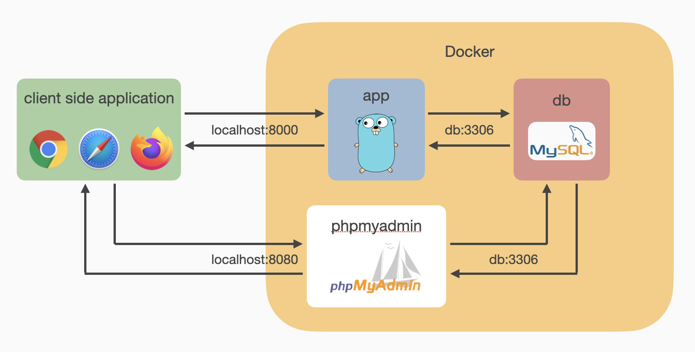
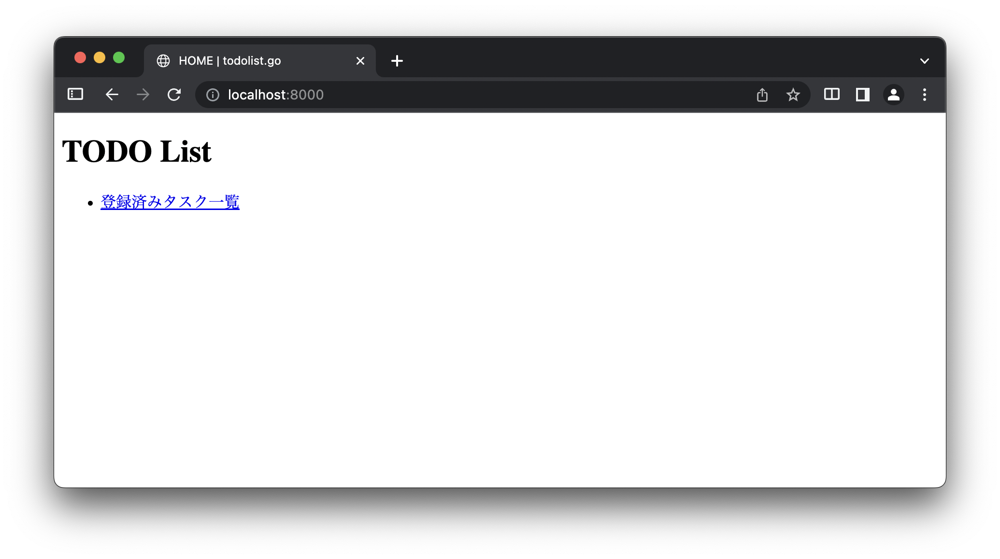
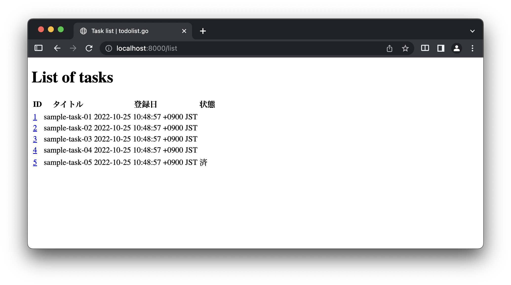
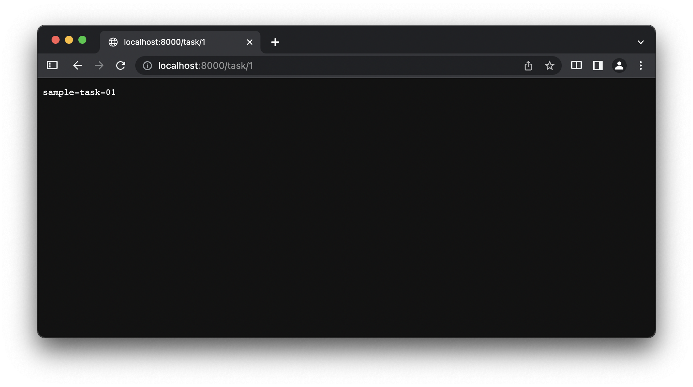

# 06: タスク管理アプリケーション
ここからは実践編として簡単なタスク管理アプリケーションの開発に取り組みます．
開発するアプリケーションの仕様は以下のページにまとめてあります．

<https://cs-sysdes.github.io/todolist.html>

演習資料では主に基本仕様に関する実装を扱います．
追加仕様に関しては資料中では扱いませんが，余裕のある人は実装に挑戦してみると良いでしょう．
また，仕様書に記載のない独自機能やアレンジを加えても構いません．

今回は特に以下の内容を通して，今後使用するプロジェクト [todolist.go](https://github.com/cs-sysdes/todolist.go) の説明と簡単な実装練習を行います．

1. [todolist.go 概観](#todolistgo-概観)
2. [タスク表示画面の作成](#タスク表示画面の作成)

実践編では，基礎編以上に説明を簡略化している部分があります．
不明点があれば遠慮せず Slack より質問を投げてください．

基礎編と同様に，提示するコードに関して以下に注意してください．
- package 宣言を省略するなど，ソースコードの一部を抜粋している場合があります．
- 表記中の `...` は特に断らない限りコードの省略を意味します．
- 提示したコードの n 行目などと指定した場合は，本資料上での行数を意味しています．
  多くの場合，実際のソースコード上での行数と一致するものではありません．


## todolist.go 概観
実践編は以下のプロジェクトをベースとして演習を進めます．
ダウンロードをした上で作業ディレクトリに配置してください．
ダウンロード方法を忘れた場合は [第1回資料](01_preliminary.html#プロジェクトの取得) を参照してください．

<https://github.com/cs-sysdes/todolist.go>

ここではこのプロジェクトの構成，主要なファイルとパッケージの役割および内容の簡単な説明を行います．
コードを書いて開発を進めるようなパートではありませんが，開発を進めるうえで重要な内容ですので，実際にファイルを開いて当該箇所を確認する．あるいはプログラムを起動して動作を確認するなどして下さい．

### アプリケーション構成
todolist.go は Go言語 で記述された Server-side アプリケーション (app) に加え，データベースとして[MySQL](https://mysql.com)を使用しています．
それぞれのサービスはこれまで通り Docker コンテナ上で動くよう docker-compose.yml に設定を記述していますので，データベースアプリケーションを個別に準備してもらう必要はありません．
一方で，プログラムは Docker コンテナに依存しないよう記述しているので，適切に環境設定を行えばローカルで動かすことも可能です．

アプリケーションの全体構成を以下に示します．



Go言語で記述された Server-side アプリケーション (app) が Docker 上で動いており，これが Client-side アプリケーションと通信を行って目的の処理を実行する点はこれまでと変わりません．
アプリケーションを起動した状態でWebブラウザなどから http://localhost:8000 へアクセスすると，タスク管理アプリケーションを使用できます．
ただし，データベースの初期化などに時間がかかるため，初回起動時のみ `docker-compose exec` コマンドの反応がやや鈍い場合があります．

```sh
$ cd ~/sysdes/tutorial.go                 # プロジェクトディレクトリは各自の環境で置き換えてください
$ docker-compose up -d                    # Dockerコンテナの起動
$ docker-compose exec app go run main.go  # アプリケーションの起動
```

Server-side アプリケーション (app) と データベース (db) は Docker 上に構築されたネットワークにより接続されています．
データベース接続に関わる設定やデータベースアクセスのための仕組みはすでに実装済みであり，app から適切なメソッドを通してSQLクエリを発行することで db 内のデータを操作可能です．

おまけとして db の状態を監視するために [phpmyadmin](https://docs.phpmyadmin.net/en/latest) を導入しています．
Webブラウザから http://localhosty:8080 へアクセスすることでMySQLサーバをブラウザ上で操作可能です．
データベース内のデータを確認したり，SQLクエリを実行してどのような結果が返ってくるかを確かめたりできますが，演習内で明示的に使用することはありません．

ここから実装済みのいくつかのファイルおよびパッケージについて説明したのち，アプリケーションを起動して挙動を確認していきます．

### todolist.go/main.go
todolist.go/main.go はタスク管理アプリケーションのエントリポイントです．
内容は formapp.go/main.go とほとんど同じなので，相違点のみ説明します．

<span class="filename">todolist.go/main.go</span>
```go
func main() {
    // initialize DB connection
    dsn := db.DefaultDSN(
        os.Getenv("DB_HOST"),
        os.Getenv("DB_PORT"),
        os.Getenv("DB_USER"),
        os.Getenv("DB_PASSWORD"),
        os.Getenv("DB_NAME"))
    if err := db.Connect(dsn); err != nil {
        log.Fatal(err)
    }
    ...
    // routing
    engine.Static("/assets", "./assets")
    engine.GET("/", service.Home)
    engine.GET("/list", service.TaskList)
    engine.GET("/task/:id", service.ShowTask) // ":id" is a parameter
    ...
```

3～8 行目は，MySQLサーバとの接続に必要な設定を環境変数から読み込む処理です．
docker-compose.yml 内で Docker コンテナ上における環境変数それぞれの値を設定しています．
ローカルで動かしたい場合には，適切な環境変数を設定することでプログラムを変更することなく接続先データベースを変更できます．

9～11 行目においてデータベースとの接続を行っています．
接続に失敗した場合 `err != nil` が `true` となるため，`log.Fatal` 関数によってプログラムが異常停止します．

14～17 行目に，初期状態でのルーティングをいくつか設定しています．
14 行目の `engine.Static` メソッドは，Go言語 で書かれたプログラムではなく，画像ファイルなどの静的データを扱うための設定です．
使用したい静的データがあれば，todolist.go/assets ディレクトリ下に配置することで，アクセスが可能になります．

17 行目の記述はここまでで説明していない Gin の機能ですが，パスの一部をパラメータとして使用する記述法になります．
たとえばこのように "task/:id" と記述した場合，":id" の部分は ":id" という文字列そのものに一致するのではなく，"task/1" などのように指定された値を `id=1` として受け取れるようになります．
詳細は [タスク表示画面の作成](#タスク表示画面の作成) にて説明します．

### todolist.go/service パッケージ
役割は formapp.go/service パッケージと同じです．
基本的にはルーティングに対応する処理を提供します．

todolist.go/service/default.go にはルート ("/") へのアクセスや formapp.go における[仮ルーティングの実装](04_state_management_v1.html#仮ルーティングの設定)に使用した `NotImplemented` 関数などを定義しています．
`Error` 関数はエラー処理を行う際の共通コードを括り出したもので，`NotImplemeted` 関数内でも使用しています．
Go言語 ではこのように**関数を返す関数**を使用することで，汎用性の高い処理を部品化し，再利用性を高めることができます．

<span class="filename">todolist.go/service/default.go</span>
```go
...
// Home renders index.html
func Home(ctx *gin.Context) {
	ctx.HTML(http.StatusOK, "index.html", gin.H{"Title": "HOME"})
}

// NotImplemented renders error.html with 501 Not Implemented
func NotImplemented(ctx *gin.Context) {
	msg := fmt.Sprintf("%s access to %s is not implemented yet", ctx.Request.Method, ctx.Request.URL)
	ctx.Header("Cache-Contrl", "no-cache")
	Error(http.StatusNotImplemented, msg)(ctx)
}

// Error returns a handler which renders error.html
func Error(code int, message string) gin.HandlerFunc {
	return func(ctx *gin.Context) {
		ctx.HTML(code, "error.html", gin.H{"Code": code, "Error": message})
	}
}
```

todolist.go/service/task.go は，このアプリケーションの管理するタスクに関わる処理を集めいたファイルです．
基本仕様 S-1.1 および S-1.2 については，基本的にこのファイルに適切な処理を定義することで実装を進めていきます．

<span class="filename">todolist.go/service/task.go</span>
```go
package service

import (
	"net/http"
	"strconv"

	"github.com/gin-gonic/gin"
	database "todolist.go/db"
)

// TaskList renders list of tasks in DB
func TaskList(ctx *gin.Context) {
	// Get DB connection
	db, err := database.GetConnection()
	if err != nil {
		Error(http.StatusInternalServerError, err.Error())(ctx)
		return
	}

	// Get tasks in DB
	var tasks []database.Task
	err = db.Select(&tasks, "SELECT * FROM tasks") // Use DB#Select for multiple entries
	if err != nil {
		Error(http.StatusInternalServerError, err.Error())(ctx)
		return
	}

	// Render tasks
	ctx.HTML(http.StatusOK, "task_list.html", gin.H{"Title": "Task list", "Tasks": tasks})
}
...
```

ここでは `TaskList` 関数の実装について解説を加えます．
この関数は，"/list" への GET リクエストに対して呼ばれ，データベース中に保存されたタスクを一覧表示します．

14～18 行目において，データベースへアクセスするための接続を取得しています．
今後ほとんどの関数で使用するコードなので覚えておいて下さい．

14 行目で使用している `database` 識別子はパッケージ名であり，変数名として `db` を使用したかったので，8 行目の import 宣言にて todolist.go/db パッケージに別名として `database` を与えています．

21～26 行目でデータベースからタスクのデータを取り出しています．

21 行目において取り出したデータを格納するための変数 `tasks` を定義しています．
変数 `tasks` の型は `database.Task` のスライスであり，`database.Task` はデータベース中のタスクデータに対応した構造体です (詳細は[後述](#todolistgodb-パッケージ))．

22 行目においてSQLクエリを発行し，データを取得しています．
`database.Getconnection` 関数によって取得できる変数 `db` は，`sqlx.DB` 型の構造体です．
`sqlx.DB.Select` メソッドは，データベースから複数のデータを取り出す際に使用するメソッドであり，第1引数としてデータに対応する構造体のスライスを指定することで，**半自動的**に取り出したデータを構造体へ束縛してくれます．
ここで「半自動的」と書いたのは，構造体宣言時に構造体のフィールドとデータの属性を結びつける**タグ**を付与する必要があるためです．

22 行目について，`err := ...` ではなく，`err = ...` である点に注意してください．
これは 14 行目においてすでに `err` 変数が定義されており，かつ，22 行目の `err` 変数は単体での代入操作を受けているため `:=` が使用できません．

29 行目はこれまでと同様に HTML テンプレートを使用してレスポンスを生成するコードです．
todolist.go/main.go 内の記述を見るとわかるように，今回は HTML テンプレートのディレクトリとして todolist.go/views を指定しています．
したがって，ここでは todolist.go/views/task\_list.html にページタイトルとデータベースから取得したタスクを埋め込み，HTML ページとして返す処理を行います．

<div class="memo">
Go言語 の標準パッケージには database/sql というデータベース操作用の機能が存在します．
github.com/jmoiron/sqlx パッケージは，標準ライブラリの database/sql パッケージを拡張したモジュールであり，内部的には標準ライブラリの機能を使用しています．
標準ライブラリをそのまま使用しても良いのですが，sqlx の方がより便利な拡張機能を備えており，多くのプロジェクトで採用されています．
たとえばここに示した構造体への束縛機能も，sqlx で提供される拡張機能です．
</div>

### todolist.go/views
todolist.go/views ディレクトリは formapp.go/templates と同じくHTMLテンプレートを配置するディレクトリです．
今回はHTMLテンプレートの新たな機能を使用しているため，その部分についてのみ説明を加えます．

以下に todolist.go/views/task\_list.html を示します．
このテンプレートは複数のタスクを一覧表示するためのものです．

<span class="filename">todolist.go/views/task_list.html</span>
```html
{{ template "header" . }}
<h1>List of tasks</h1>
{{ if not .Tasks }}
<p>登録データがありません．</p>
{{ else }}
<table>
    <tr>
        <th>ID</th>
        <th>タイトル</th>
        <th>登録日</th>
        <th>状態</th>
    </tr>
    {{ range $task := .Tasks }}
    <tr>
        <td><a href="/task/{{ $task.ID }}">{{ $task.ID }}</a></td>
        <td>{{ $task.Title }}</td>
        <td>{{ $task.CreatedAt }}</td>
        <td>{{ if $task.IsDone }}済{{ end }}</td>
    </tr>
    {{ end }}
</table>
{{ end }}
{{ template "footer" }}
```

1 行目および 23 行目の記述は，他のテンプレートファイルにおいて定義した部分テンプレートを使用するための記述です．
ここではそれぞれ `"header"` と `"footer"` テンプレートを呼び出していますが，これらはそれぞれ以下のように定義されています．

<span class="filename">todolist.go/views/\_header.html</span>
```html
{{ define "header" }}
<!DOCTYPE html>
<html>
<head>
    <meta charset="utf-8">
    <title>{{ .Title }} | todolist.go</title>
    <link rel="stylesheet" href="/assets/style.css">
    <script type="text/javascript" src="/assets/script.js"></script>
</head>
<body>
{{ end }}
```

<span class="filename">todolist.go/views/\_footer.html</span>
```html
{{ define "footer" }}
</body>
</html>
{{ end }}
```

これらはそれぞれHTML文書の開始部および終了部であり，ほぼどのようなHTMLであっても共通するパーツとなることが多い部分です．
したがって，このように共有パーツとしてあらかじめ定義しておき，使用時には単純にこれらの定義を呼び出すことで再利用性を高めています．
一方で，共有パーツはこの他にも比較的自由に定義できますが，todolist.go/views/\_header.html のように共有パーツ側に変数が存在する場合，Go言語 プログラム中から呼び出す際に渡すべき変数がわかりづらくなるため，多用は避けるべきかもしれません．

todolist.go/views/task\_list.html の説明に戻ります．

3 行目や 18 行目では，`{{ ... }}` の内部で `if` キーワードによる条件分岐を使用しています．
同様に，13 行目では `range` キーワードを使用した繰り返し表現を使用しています．
またそれぞれの効果範囲は `{{ else }}` や `{{ end }}` によって明示されます．

Go言語 のテンプレート機能では，このように `{{ ... }}` ブロックを使用することで変数の埋め込みだけでなく条件分岐や簡単なループ表現も扱うことができます．
これにより生成するHTML文書を柔軟に表現できるようになっています．
一方で，テンプレート記法はやや独特な文法となっているため，ある程度の慣れが必要かもしれません．
特に Go言語 とは異なりスコープの区切りをキーワード (`{{ end }}`など) で指定する方式となっているため，インデントを適切に設定するなどして効果範囲がわかりやすいよう工夫する必要があります．
慣れるまでは todolist.go/views/task\_list.html の書き方を真似すると良いでしょう．

テンプレート機能のより詳細な使い方は [公式ドキュメント](https://pkg.go.dev/text/template) を参照してください．

### todolist.go/db パッケージ
ここからは formapp.go までは扱ってこなかったデータベース周りの話になります．

todolist.go/db/conn.go は，データベースとの接続まわりをサポートする機能を実装したファイルのため，今後特に編集する必要性は生じないと思います．
このファイルには `GetConnection` 関数が定義されており，先にも説明した通りデータベースへのアクセスを行うためにはこの関数を通して `sqlx.DB` 構造体 (へのポインタ) を取得する必要があることだけ覚えておいてください．
なお，ファイルの内容自体は非常にオーソドックスな実装ですので，処理の内容は簡単に追うことができるのではないでしょうか．

一方で，todolist.go/db/entity.go ファイルは，開発を進めるにあたって編集 (機能追加) する機会が多くなるかと思います．
初期実装を以下に示します．
初期実装では，データベース内にすでに存在するタスクデータに対応する構造体のみが定義されています．

<span class="filename">todolist.go/db/entity.go</span>
```go
package db

// schema.go provides data models in DB
import (
	"time"
)

// Task corresponds to a row in `tasks` table
type Task struct {
	ID        uint64    `db:"id"`
	Title     string    `db:"title"`
	CreatedAt time.Time `db:"created_at"`
	IsDone    bool      `db:"is_done"`
}
```

[serviceパッケージ](#todolistgoservice-パッケージ) の説明において，以下のように**構造体のフィールドとデータの属性を結びつけるタグ**について触れました．

> `sqlx.DB.Select` メソッドは，データベースから複数のデータを取り出す際に使用するメソッドであり，第1引数としてデータに対応する構造体のスライスを指定することで，**半自動的**に取り出したデータを構造体へ束縛してくれます．
> ここで「半自動的」と書いたのは，構造体宣言時に構造体のフィールドとデータの属性を結びつける**タグ**を付与する必要があるためです．

9～14 行目の構造体の定義において，型の後についている <code class="hljs">\`db:"..."\`</code> の部分が**タグ**になり，`...` にデータベース上でのデータの属性名を指定します．
たとえば 10 行目の <code class="hljs">ID uint64 \`db:"id"\`</code> は，`uint64` 型のフィールド `ID` を，データベース中のタスクテーブル内のデータの `id` 属性と対応させることを意味します．

次に，ここで定義した構造体に対応するデータを保存するためのデータベースの設定について説明します．

### データベースのテーブル定義
データベースの設定は，todolist.go/docker/db ディレクトリ内に配置しています．
開発時には主に todolist/docker/db/sql ディレクトリ内のファイルを編集することになるかと思います．

todolist.go/docker/db/sql/01\_create\_tables.sql はテーブルの定義を記述したファイルになります．
初期状態では以下の通りタスクデータを保存する tasks テーブルのみを定義しています．
データベースに新たなテーブルを追加したい場合には，このファイルを編集するとよいでしょう．

<span class="filename">todolist.go/docker/db/sql/01\_create\_tables.sql</span>
```sql
-- Table for tasks
DROP TABLE IF EXISTS `tasks`;

CREATE TABLE `tasks` (
    `id` bigint(20) NOT NULL AUTO_INCREMENT,
    `title` varchar(50) NOT NULL,
    `is_done` boolean NOT NULL DEFAULT b'0',
    `created_at` datetime NOT NULL DEFAULT CURRENT_TIMESTAMP,
    PRIMARY KEY (`id`)
) DEFAULT CHARSET=utf8mb4;
```

この定義の通り，タスクは属性として id, title, is\_done, created\_at を持ちます．
todolist.go/db/entity.go 内の構造体 `Task` は，ここに定義したデータの属性名および型と対応するよう定義しています．

ここに示した定義において，id はデータ登録時に重複しない値が自動で付与されるよう設定しており，このテーブルにおける id の一意性 (同じ id を持つデータが同じテーブル内に存在しない性質) を保証しています．
また特に指定がなければ，is\_done 属性はデフォルト値として false，created\_at 属性はデフォルト値として現在時刻が設定されるようにしています．
したがって，データ登録時に必ず指定しなければいけない属性は title のみということになります．


todolist.go/docker/db/sql/02\_initial\_data.sql には，初期データとしていくつかのタスクを登録するためのクエリを記述しています．
初期データを登録したい場合は，こちらのファイルへデータ登録のためのクエリを追記すると良いでしょう．

<span class="filename">todolist.go/docker/db/sql/02\_initial\_data.sql</span>
```sql
INSERT INTO `tasks` (`title`) VALUES ("sample-task-01");
INSERT INTO `tasks` (`title`) VALUES ("sample-task-02");
INSERT INTO `tasks` (`title`) VALUES ("sample-task-03");
INSERT INTO `tasks` (`title`) VALUES ("sample-task-04");
INSERT INTO `tasks` (`title`, `is_done`) VALUES ("sample-task-05", true);
```

これら2 つのファイルは，データベースの Docker コンテナをはじめて起動した際に読み込まれ，データベースを構築します．
したがって，これらのファイルを編集した場合には，編集した結果を反映するために一度データベースを完全に初期化する必要があります．

初期化処理が必要になったときに再び説明しますが，データベースコンテナを初期化したうえで再起動するには以下のコマンドを実行する必要があります．
```sh
$ docker-compose down --rmi all --volumes --remove-orphans
$ docker-compose up -d
```

### 画面構成
プロジェクトの構成を概観したところで，動作確認をしてみましょう．
まずは Docker コンテナを起動します．
初回はコンテナイメージのダウンロードおよびビルドを行うため，少し時間がかかります．
```sh
$ docker-compose up -d
```
前回までとは異なり，今回はこのコマンド 1 つで app, db, phpmyadmin の 3 つのサービスを同時に起動しています．
app および phpmyadmin は db コンテナを参照するサービスですので，これらの間には依存関係が存在します．
こうした依存関係は docker-copmpose.yml において自動的に解決するよう設定を記述していますので，特にコンテナの起動順序について気にする必要はありません．

コンテナが起動したら，以下のコマンドで app を起動します．
```sh
$ docker-compose exec app go run main.go
```
コマンド自体はこれまでと同様ですが，db コンテナとの接続の関係で反応が鈍い場合があります．
準備ができたら以下のようなログが表示されますので，気長にお待ちください．
```sh
$ docker-compose exec app go run main.go
[GIN-debug] [WARNING] Creating an Engine instance with the Logger and Recovery middleware already attached.

[GIN-debug] [WARNING] Running in "debug" mode. Switch to "release" mode in production.
 - using env:   export GIN_MODE=release
 - using code:  gin.SetMode(gin.ReleaseMode)

[GIN-debug] Loaded HTML Templates (7): 
        - header
        - error.html
        - task_list.html
        - _header.html
        - _footer.html
        - footer
        - index.html

[GIN-debug] GET    /assets/*filepath         --> github.com/gin-gonic/gin.(*RouterGroup).createStaticHandler.func1 (3 handlers)
[GIN-debug] HEAD   /assets/*filepath         --> github.com/gin-gonic/gin.(*RouterGroup).createStaticHandler.func1 (3 handlers)
[GIN-debug] GET    /                         --> todolist.go/service.Home (3 handlers)
[GIN-debug] GET    /list                     --> todolist.go/service.TaskList (3 handlers)
[GIN-debug] GET    /task/:id                 --> todolist.go/service.ShowTask (3 handlers)
[GIN-debug] Listening and serving HTTP on :8000
```

app が起動したらWebブラウザから <http://localhost:8000> へアクセスし，以下のページが表示されることを確認してください．



表示されている「登録済みタスク一覧」のリンクをクリックすると，以下のページへ遷移します．



このページは登録されているタスクを一覧表示するものです．
表示に至るまでの処理を追えば，/list に対する GET リクエストが飛ばされ，`service.TaskList` 関数が実行されて views/task\_list.html がレンダリングされた状態となります．

タスクの一覧表示では，ID にリンクを設定しています．
それぞれのリンクは /task/:id への GET アクセスを自身のID値を設定して飛ばすよう設定されており，たとえば ID = 1 のリンクをクリックした場合，以下のページに遷移します．



/task/:id への GET アクセスは `service.ShowTask` 関数を呼び出しますが，現在の実装ではタスクのタイトルのみを文字列で返すプログラムとなっているため，味気ない表示が返されるのみです．
次のセクションでは，簡単な練習としてこの表示を改善してみます．


## タスク表示画面の作成
タスク表示ページの改善を行うにあたり，まずは `service.ShwoTask` 関数を理解します．

<span class="filename">todolist.go/service/task.go</span>
```go
...

// ShowTask renders a task with given ID
func ShowTask(ctx *gin.Context) {
    ...
	// parse ID given as a parameter
	id, err := strconv.Atoi(ctx.Param("id"))
	if err != nil {
		Error(http.StatusBadRequest, err.Error())(ctx)
		return
	}

	// Get a task with given ID
	var task database.Task
	err = db.Get(&task, "SELECT * FROM tasks WHERE id=?", id) // Use DB#Get for one entry
	if err != nil {
		Error(http.StatusBadRequest, err.Error())(ctx)
		return
	}

	// Render task
	ctx.String(http.StatusOK, task.Title)  // Modify it!!
}
```

22 行目を修正すべきであることは明らかですが，**パスパラメータ**の仕組みを理解するため上から順に説明します．

ルーティングの設定より，`service.ShowTask` 関数は /task/:id への GET リクエストに対応する処理です．
ここで，リクエストパス中の :id の部分はパラメータであり，このようなパスの一部をパラメータとして扱う機能を**パスパラメータ**と呼びます．

Gin では `gin.Context.Param` メソッドによって設定されたパスパラメータを受け取ることができます．
今回は "id" を key とするパラメータが設定されているため，7 行目に示す通り `ctx.Param("id")` と記述することで，:id の部分に指定された値を文字列として取得します．
ここでは同時に ID が整数値であることを検証するため，`strconv.Atoi` 関数で文字列から整数値への変換を試しています．
仮にここで変換に失敗した場合，ID として不正な値が入力されたことを意味するので，BadRequestエラーを返すようエラー処理を実装しています．

14～19 行目は，指定された ID を持つタスクをデータベースから取得するコードです．
`service.TaskList` 関数では複数のタスクを受け取る可能性があったため `sqlx.DB.Select` メソッドを使用しましたが，今回は結果を 1 つのみ受け取るため `sqlx.DB.Get` メソッドを使用しています．
なお，ID の一意性はテーブル定義において保証されているため，`SELECT * FROM tasks WHERE id=1` などと ID を指定して取得クエリを発行した場合には，必ず 0 または 1 つのデータのみがクエリの結果として返されます．
もし適合するデータが 0 個の場合，すなわちテーブル内に存在しない場合，`err != nil` となりエラー処理が実行されます．

このままではタイトルが文字列で表示されるだけのページとなってしまうため，まずはページのテンプレートを用意します．
適当なファイルとして task.html をtodolist.go/views ディレクトリ下に配置し，以下のようなHTMLを記述します．
なお，ここで示すHTMLテンプレートの内容は実装例であり，好みに応じてアレンジを加えていただいて構いません．

<span class="filename">todolist.go/views/task.html</span>
```html
{{ template "header" . }}
<h1>Task: {{ .Title }}</h1>
<dl>
    <dt>ID</dt>
    <dd>{{ .ID }}</dd>
    <dt>Created at</dt>
    <dd>{{ .CreatedAt }}</dd>
    <dt>Status</dt>
    <dd><input type="checkbox" {{ if .IsDone }}checked {{ end }}disabled/>済</dd>
</dl>
<a href="/list"><button type="button">リストへ戻る</button></a>
{{ template "footer" }}
```

このHTMLテンプレートを呼び出すよう，`service.ShowTask` 関数の最終行を修正します．

<span class="filename">todolist.go/service/task.go</span>
```go
    ...
	// Render task
	//ctx.String(http.StatusOK, task.Title)  // Modify it!!
    ctx.HTML(http.StatusOK, "task.html", task)
}
```

ここでは `gin.H` を利用して連想配列をテンプレートへ渡すのではなく，`task` 変数を直接渡しています．
Go言語 は割と柔軟で，このように記述してもよしなに扱ってくれます．
ただし，渡す構造体のフィールドすべてが文字列への変換に対応している必要があります．

##### 練習問題 6-1
上記の修正を適用し，タスクの表示画面を改善した結果を確認してみましょう．

##### 練習問題 6-2
タスク一覧表示画面について，各自の裁量で見やすさなど改善を施してみましょう．

##### 練習問題 6-3 (発展的内容)
タスクに簡単な説明文を追加して表示できるようテーブルや構造体の定義，タスク表示画面を拡張してみましょう．
資料での説明を超える発展的内容であるため，必ずしも取り組む必要はありません．

【ヒント】
- データベース上では `varchar(256)` などとすることで，比較的長いテキストのための属性を定義できる．
- テーブル定義などを更新した場合，データベースコンテナの初期化が必要となる．


## まとめ
今回は実践編の初回としてベースプロジェクト todolist.go の構成を説明し，簡単なタスク表示ページの実装を行いました．
次回からは[基本仕様](https://cs-sysdes.github.io/todolist.html)に示す機能を段階的に実装し，実用的なタスク管理アプリケーションを構築していきます．

今回の内容は以上になります．
お疲れさまでした．
