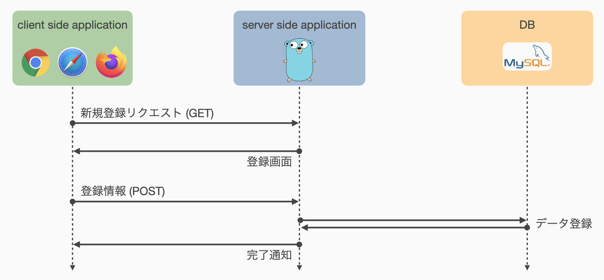
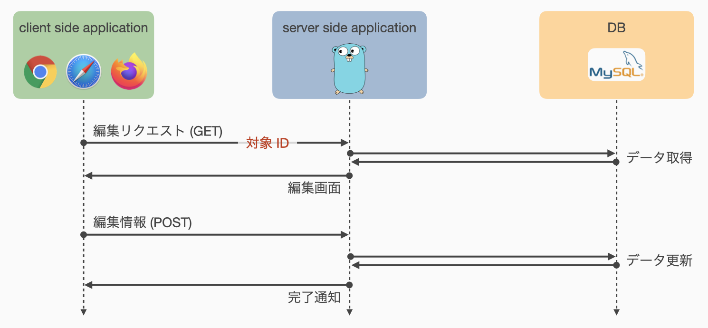
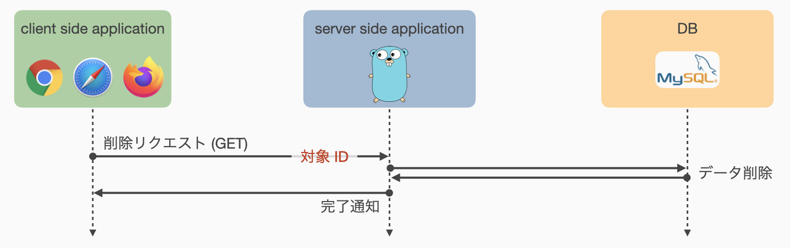

# 07: タスクの作成・編集・削除
今回は以下の手順に従って[要求仕様](https://cs-sysdes.github.io/todolist.html)に示された基本仕様 S-1.1 の実装を行います．

1. [ルーティング設定](#ルーティング設定)
1. [タスクの新規登録](#タスクの新規登録)
2. [既存タスクの編集](#既存タスクの編集)
3. [既存タスクの削除](#既存タスクの削除)

[前回](06_todolist.md)から引き続いて [todolist.go](https://github.com/cs-sysdes/todolist.go) での実装を進めます．


## ルーティング設定
それぞれの機能について仮ルーティングを行います．

まず，タスクの新規登録について一般的な処理のフローを以下に示します．



タスクを新規登録するため，Client-side アプリケーションは Server-side アプリケーションに対して登録フォームを要求します．
このリクエストは登録フォームという画面を表示させることを目的とするので，通常は GET リクエストになります．
このとき，Server-side アプリケーションの動作としては，登録フォームを備えた画面を返すことが期待されます．

ユーザは表示された登録フォームに登録するタスクの情報を入力し，Server-side アプリケーションへ送信します．
これは情報の送信を目的とするため，通常は POST リクエストになるでしょう．
Server-side アプリケーションは，受け取った情報から DB 内に新規タスクを保存し，完了したことを Client-side へ通知します．

以上より，タスクの新規登録には 1 つの GET メソッドと 1 つの POST メソッドを受け付けるルーティングが必要そうです．
「新たなタスク」に関連する処理なので，パスは /task/new などで良いでしょう．

---
同様に，タスクの編集について一般的な処理のフローを示します．



タスクの新規登録フローとほとんど同じですが，編集作業は「特定のタスク」に対する操作なので，編集フォームを要求する最初の GET リクエストには編集対象を指定するための ID を指定できるようにするべきでしょう．
Server-side アプリケーションは Client-side からの編集フォームの表示要求に対し，指定されたタスクを DB から取得したうえでフォーム中にタスクの情報を埋め込んで返すことが期待されます．

編集後の情報送信はいつも通り POST リクエストで行います．
Server-side アプリケーションは，リクエストに従って DB 内データを更新し，完了通知を返信することが期待されます．

以上より，タスクの編集も 1 つの GET メソッドと 1 つの POST メソッドを受け付けるルーティングを設定することとします．
このとき，タスクの新規登録時とは異なり，タスクの編集フォーム取得のための GET リクエストはパラメータ (ID) を持つことになります．
「タスクの編集」に関連する処理なので，パスは /task/edit などとしましょう．
ただし，パラメータとしてタスクの ID を受け取るため，/task/edit/:id とする方が良さそうです．

---
タスクの削除フローは，以下に示す通り先の 2 つより単純です．



Client-side アプリケーションは Server-side アプリケーションに削除したいタスクの ID を通知します．
Server-side アプリケーションは受け取った ID に該当するタスクを DB 上から削除し，処理の完了通知を返信します．

この操作では特に情報を送信することはないため，GET リクエストで削除指示を直接送ることとします．
また，パラメータとして ID を持つ「タスクの削除」に関連する処理なので，パスは /task/delete/:id で良いでしょう．

---
以上の設計方針を素直に実装すると以下のようになります．

<span class="filename">todolist.go/main.go</span>
```go
    ...
    // タスクの新規登録
    engine.GET("/task/new", service.NotImplemented)
    engine.POST("/task/new", service.NotImplemented)
    // 既存タスクの編集
    engine.GET("/task/edit/:id", service.NotImplemented)
    engine.POST("/task/edit/:id", service.NotImplemented)
    // 既存タスクの削除
    engine.GET("/task/delete/:id", service.NotImplemented)
    ...
```

この仮ルーティングの設定は一般的な実装例であり，必ずしもこの通りに実装する必要はありません．
本資料ではこのルーティング設定に従って実装を進めますが，明確な目的や理由をもって独自のルーティングを行うことを妨げるものではありません．

<div class="memo">
タスクの編集において，編集後の情報を POST メソッドで送信すると説明しましたが，実際は処理の内容を考えると <b>PUT</b> (あるいは <b>PATCH</b>) リクエストとする方が適切です．
また，タスクの削除においても本来は <b>DELETE</b> メソッドを使用する方が適切です．
しかしながら，HTML の form タグはメソッドとして GET か POST にしか対応しておらず，また HTML 単体では他に PUT や DELETE といったメソッドのリクエストを送信する手段がないため，ここでは POST リクエストとして実装しています．
どうしても PUT や DELETE でリクエストを送信したい場合は，一般に JavaScript の力を借りることになります．
</div>


## タスクの新規登録
タスクの新規登録フローを再掲します ([ルーティング設定](#ルーティング設定)にて示したものと同じです)．


タスクの新規登録において Server-side アプリケーションに求められる処理は，1) 新規登録リクエストに対して登録フォームを返す，2) POST されたタスク情報から DB に新しいタスクを登録する，の 2 つです．
それぞれについて順に実装していきます．

これ以降，タスクの持つフィールドは初期実装を仮定して資料を進めます．
[前回の練習問題 6-3](06_todolist.html#練習問題-6-3-発展的内容) などで独自のフィールドを追加している場合は，それらについても入力欄を設定するなど，適宜資料の読み替えが必要となるので注意してください．

### 新規登録フォーム
まずは新しいタスクの情報を入力するための登録画面を作成します．
以下に示すタスクの初期実装では，新規登録時にユーザが入力すべき項目は `Title` のみです．
その他のフィールドは，DB が自動的に適切な値を設定してくれます．

<span class="filename">todolist.go/db/entity.go</span>
```go
type Task struct {
	ID        uint64    `db:"id"`
	Title     string    `db:"title"`
	CreatedAt time.Time `db:"created_at"`
	IsDone    bool      `db:"is_done"`
}
```

したがって，以下のような登録画面を作成することとします．
入力した情報は /task/new へ POST したいので，`<form>` タグの属性として `action="/task/new"` および `method="POST"` を指定しています．

<span class="filename">todolist.go/views/form\_new\_task.html</span>
```html
{{ template "header" . }}
<h1>タスクの新規登録</h1>
<form action="/task/new" method="POST">
    <label>Title</label><input type="text" name="title" required>
    <br>
    <input type="submit" value="登録">
    <a href="/list"><button type="button">戻る</button></a>
</form>
{{ template "footer" }}
```

5 行目の `<br>` タグは改行をいれるためのタグです．
本来は `<div>` タグなどを用いて構造化した上で見た目を調整すべきですが，ここでは最低限の機能を最低限の見た目で提供するため，このように記述しています．

6 行目に配置した「登録」ボタンを押すと，`input[name="title"]` フィールドに入力した値を Server へ POST します．
`input[name="title"]` フィールドに付与されている `required` 属性は，このフィールドを空のまま送信できないよう制約を付けるものです．
7 行目に配置した「戻る」ボタンは単純に /task/list へのリンクとなっており，新規登録を中止してタスク一覧ページへ戻る機能を提供しています．


[練習問題 6-3](06_todolist.html#練習問題-6-3-発展的内容) でタスクのフィールドに説明文を追加している場合は，以下のような `<textarea>` を form の子要素として 6 行目あたりに追加すると良いでしょう．

```html
    <label>Description</label>
    <textarea name="description"></textarea>
```

/task/new への GET リクエストにはこの画面を返せばよいだけなので，以下のような関数 `service.NewTaskForm` を定義します．
表示する画面 todolist.go/views/form\_new\_task.html は `{{ template header . }}` によってページの "Title" パラメータを要求する点に注意してください．

<span class="filename">todolist.go/service/task.go</span>
```go
...
func NewTaskForm(ctx *gin.Context) {
    ctx.HTML(http.StatusOK, "form_new_task.html", gin.H{"Title": "Task registration"})
}
```

仮ルーティングの設定を更新 (下記 3 行目) し，Webブラウザから /task/new へアクセスしたときにタスクの新規登録フォームが表示されることを確認してください．

<span class="filename">todolist.go/main.go</span>
```go
    ...
    // タスクの新規登録
    engine.GET("/task/new", service.NewTaskForm)
    engine.POST("/task/new", service.NotImplemented)
    ...
```

このままでは URL を直接打ち込まないとタスクの新規登録ページへ進むことができないので，どこかのページに新規登録ページへのリンクを設置する必要があります．
今回は，/list で表示されるタスク一覧の上にリンクを設定することとしましょう．

<span class="filename">todolist.go/views/task\_list.html</span>
```html
{{ template "header" . }}
<h1>List of tasks</h1>
<p><a href="/task/new">新規登録</a></p>
{{ if not .Tasks }}
<p>登録データがありません．</p>
{{ else }}
<table>
    ...
```

3 行目の `<p><a href="/task/new">新規登録</a></p>` が追加したコードになります．
これでタスクの一覧表示画面から新規登録画面へ遷移可能になりました．

### 登録処理
タスクの新規登録画面を表示できたので，POST されたフォームデータから新規タスクを登録する関数 `service.RegisterTask` を実装します．
POST されたデータを受け取る部分，および，DB への接続を獲得する部分は，これまでの演習より以下の通り記述できることがわかります．

<span class="filename">todolist.go/service/task.go</span>
```go
...
func RegisterTask(ctx *gin.Context) {
    // Get task title
    title, exist := ctx.GetPostForm("title")
    if !exist {
        Error(http.StatusBadRequest, "No title is given")(ctx)
        return
    }
	// Get DB connection
	db, err := database.GetConnection()
	if err != nil {
		Error(http.StatusInternalServerError, err.Error())(ctx)
		return
	}
    // Create new data with given title on DB
    ...
```

DB へのデータの登録は INSERT 文で行うことができますが，`sqlx.DB` には `Insert` メソッドがありません．
したがって，`sqlx.DB.Exec` メソッドを使用して INSERT 文を発行します．

```go
    ...
    // Create new data with given title on DB
    result, err := db.Exec("INSERT INTO tasks (title) VALUES (?)", title)
	if err != nil {
		Error(http.StatusInternalServerError, err.Error())(ctx)
		return
	}
    // Render status
    ...
```

ここまでで POST された情報に基づく新しいタスクを DB へ登録する処理が完了しました．
最後に処理の完了を通知する部分ですが，単に成功したことだけを通知するページにあまり意味はないので，登録したタスク自体を表示するページへ遷移させましょう．
つまり，/task/:id へ**リダイレクト**することを考えます．

ページのリダイレクトはよく使う機能なので，`gin.Context.Redirect` としてメソッド化されています．
また，このような特定の処理を行った結果として対応する別のページ (リソース) へリダイレクトする場合には `302 Found` のステータスが適当です．
したがって，いまリダイレクトする先のパスを変数 `path` で与えるとした場合，以下のように実装できます．

```go
    ...
    // Render status
    path := ...
    ctx.Redirect(http.StatusFound, path)
}
```

さて，問題はこの変数 `path` をどのように設定するかです．
リダイレクトしたい先のパスは /task/:id であり，:id の部分は今さっき登録した新しいタスクの ID となっているべきです．
今さっき登録した新しいタスクの ID は DB が自動で割当てているため，これを取得する必要があります．

であれば，もう一度 DB にアクセスして最新の ID を取得して…という方法は残念ながら**正しく動かない可能性があります**．
たとえば，2 つ以上のタスクがほぼ同時に登録された場合，1 つの INSERT 文とそれに対応する ID 取得処理がアトミックに実行されれば問題ありませんが，それらの間に別のINSERT 文の実行が挟まってしまった場合，取得できる ID は最後に登録されたタスクの ID となってしまうため，1 つめの INSERT 文で登録されたタスクの ID  ではなくなります．

一部の DB アプリケーションはこうした要求に対応するため，特定のクエリによって挿入されたデータの ID を返す機能を持っています．
Go言語 の database/sql パッケージはこうした機能に対応できるよう設計されており，MySQL を使用する場合は，`sql.Result.LastInsertId` メソッドによって対応するデータの ID を取得可能です．
`sql.Result` は先ほど `result, err := db.Exec(...)` にて `result` として返されているため，`result.LastInsertId()` とすることで ID を取得します．

`sql.Result.LastInsertId` は失敗する可能性のある処理 (`err` を返すメソッド) です．
成功した場合 (`err == nil` の場合) には取得した ID に基づいて /task/:id へ遷移するよう実装します．
一方で，失敗した場合 (`err != nil` の場合) には ID を取得することができないので，あきらめて /list へ戻ることとします．

以上をプログラムとして実装すると以下のようになります．
3 行目の条件分岐は，エラーがない場合に実行したい処理なので，いつもの `err != nil` ではなく `err == nil` であることに注意してください．

```go
    // Render status
    path := "/list"  // デフォルトではタスク一覧ページへ戻る
    if id, err := result.LastInsertId(); err == nil {
        path = fmt.Sprintf("/task/%d", id)   // 正常にIDを取得できた場合は /task/<id> へ戻る
    }
    ctx.Redirect(http.StatusFound, path)
}
```

ここまでをまとめると，`service.RegisterTask` 関数は以下のように実装できます．

<span class="filename">todolist.go/service/task.go</span>
```go
...
func RegisterTask(ctx *gin.Context) {
    // Get task title
    title, exist := ctx.GetPostForm("title")
    if !exist {
        Error(http.StatusBadRequest, "No title is given")(ctx)
        return
    }
	// Get DB connection
	db, err := database.GetConnection()
	if err != nil {
		Error(http.StatusInternalServerError, err.Error())(ctx)
		return
	}
    // Create new data with given title on DB
    result, err := db.Exec("INSERT INTO tasks (title) VALUES (?)", title)
	if err != nil {
		Error(http.StatusInternalServerError, err.Error())(ctx)
		return
	}
    // Render status
    path := "/list"  // デフォルトではタスク一覧ページへ戻る
    if id, err := result.LastInsertId(); err == nil {
        path = fmt.Sprintf("/task/%d", id)   // 正常にIDを取得できた場合は /task/<id> へ戻る
    }
    ctx.Redirect(http.StatusFound, path)
}
```

ルーティング設定を更新し，タスクが正常に登録できることを確認してください．

<div class="memo">
<code class="hljs">sql.Result.LastInsertId</code> メソッドは，使用する DB アプリケーションによっては対応していません．
今回は対応している MySQL を使用したため，このメソッドを利用して簡単に ID を取得できましたが，MySQL と並んで有名な PostgreSQL を使用した場合にはこのメソッドを利用できません．
代わりに PostgreSQL には INSERT 後のデータを直接 INSERT 文から返す方法があり，それを使用することで同様の処理は実行可能です．
</div>


## 既存タスクの編集
既存タスクの編集フローを再掲します ([ルーティング設定](#ルーティング設定)にて示したものと同じです)．


既存タスクの編集において Server-side アプリケーションに求められる処理は，1) 編集リクエストに応じて対応するタスクの編集フォームを返す，2) POST されたタスク情報から DB 内のデータを更新する，の 2 つです．
それぞれについて順に実装していきます．

### 編集フォーム
編集フォーム画面を取得するためのリンクを作成します．
今回はタスクの個別表示ページに編集ボタンを追加する方法をとります．

<span class="filename">todolist.go/views/task.html</span>
```html
{{ template "header" . }}
<h1>Task {{ .ID }}</h1>
<dl>
    <dt>Title</dt>
    <dd>{{ .Title }}</dd>
    <dt>Created at</dt>
    <dd>{{ .CreatedAt }}</dd>
    <dt>Status</dt>
    <dd><input type="checkbox" {{ if .IsDone }}checked {{ end }}disabled/>済</dd>
</dl>
<a href="/list"><button type="button">リストへ戻る</button></a>
<a href="/task/edit/{{ .ID }}"><button type="button">編集</button></a>
{{ template "footer" }}
```

これは[前回作成したタスク表示画面](06_todolist.html#タスク表示画面の作成)に対し，12 行目に配置した編集ボタンを追加したものです．

次に，編集フォーム画面を作成します．
編集フォームはタスク表示画面や新規登録フォームとほとんど同じように実装できます．
ただし，新規登録フォームではタスクの Title のみ入力可能でしたが，編集フォームでは Title に加えてタスクの完了状態も編集できる必要があります．
ここでは編集フォーム画面を todolist.go/views/form\_edit\_task.html として以下のように実装するととします．

<span class="filename">todolist.go/views/form\_edit\_task.html</span>
```html
{{ template "header" . }}
<h1>Task {{ .Task.ID }}: edit</h1>
<form action="/task/edit/{{ .Task.ID }}" method="POST">
    <label>Title</label><input type="text" name="title" value="{{ .Task.Title }}" required>
    <br>
    <input type="radio" name="is_done" value="t" {{ if .Task.IsDone }}checked{{ end }}><label>完了</label>
    <input type="radio" name="is_done" value="f" {{ if not .Task.IsDone }}checked{{ end }}><label>未完了</label>
    </br>
    <input type="submit" value="登録">
    <a href="/task/{{ .Task.ID }}"><button type="button">戻る</button></a>
</form>
{{ template "footer" }}
```

4行目，`input[name="title"]` で Title の入力フィールを作成するのは新規登録画面と同じですが，編集時にはすでに設定された Title が存在するため，`value="{{ .Task.Title }}"` として登録済みの値をフィールド内に挿入した状態でフォームを返しています．

6, 7 行目はタスクの完了状態をラジオボタンで表現しています．
`input[type="radio"]` は `name` 属性が同じ複数の入力フィールドを自動的にグループ化し，排他的に選択できるようになっています．
`checked` 属性をつけることで選択された状態にできるため，ここでは編集前のタスクの状態に応じて適切なものに `checked` 属性を設定しています．

9, 10 行目の処理は新規登録画面と同様です．
ただし，ここでは「戻る」ボタンの遷移先として /task/:id を指定しています．

この画面を返す処理を行う関数 `service.EditTaskForm` を実装します．

<span class="filename">todolist.go/service/task.go</span>
```go
...
func EditTaskForm(ctx *gin.Context) {
    // ID の取得
    id, err := strconv.Atoi(ctx.Param("id"))
    if err != nil {
        Error(http.StatusBadRequest, err.Error())(ctx)
        return
    }
	// Get DB connection
	db, err := database.GetConnection()
	if err != nil {
		Error(http.StatusInternalServerError, err.Error())(ctx)
		return
	}
    // Get target task
    var task database.Task
    err = db.Get(&task, "SELECT * FROM tasks WHERE id=?", id)
    if err != nil {
        Error(http.StatusBadRequest, err.Error())(ctx)
        return
    }
    // Render edit form
    ctx.HTML(http.StatusOK, "form_edit_task.html",
        gin.H{"Title": fmt.Sprintf("Edit task %d", task.ID), "Task": task})
}
```

ルーティング設定を更新し，動作確認をします．

<span class="filename">todolist.go/main.go</span>
```go
    ...
    // 既存タスクの編集
    engine.GET("/task/edit/:id", service.EditTaskForm)
    engine.POST("/task/edit/:id", service.NotImplemented)
    ...
```

確認点は，以下の通りです．

1. 個別のタスクを表示したときに「編集」ボタンが表示される
2. 「編集」ボタンを押すと編集フォームが表示される
3. 編集フォーム上で「更新」を押すと，処理が実装されていないため，エラーページが表示される


### 更新処理
タスクの更新処理はタスクの新規登録処理とほとんど同じです．
したがって，更新処理の実装は練習問題とします．

##### 練習問題 7-1
新規登録処理を行う `service.RegisterTask` 関数を参考に，更新処理を行う関数 `service.UpdateTask` を実装し，ルーティング設定を修正したうえで動作確認をしてください．

～実装のヒント～
- 更新対象の ID は `gin.Context.Param` で取得できます．
- 編集フォームから POST されるデータは，`"title"` および `"is_done"` の 2 つです．これらの key に対応する値を `gin.Context.GetPostForm` メソッドで取得します．
    - `"is_done"` に対応する value は，`strconv.ParseBool` 関数で bool 値に変換できます．
- DB 内に存在するデータの更新は UPDATE 文によって行います．
    - UPDATE 文は INSERT 文と同様に `sql.DB.Exec` メソッドで実行します．
    - WHERE 句で更新対象の ID を指定することで，対象のタスクのみをアップデートします．


## 既存タスクの削除
既存タスクの削除フローを再掲します ([ルーティング設定](#ルーティング設定)にて示したものと同じです)．


既存タスクの削除において Server-side アプリケーションに求められる処理は，削除リクエストに応じて対応するタスクを DB 上から削除することです．
一般にデータの削除を行う方法には，1) データを完全に消去する方法，2) データに削除フラグを立てる方法，の 2 つが考えられます．
ここでは 1) データを完全に消去する方法で既存タスクの削除処理を実装します．

### 削除リクエストの送信
はじめに，削除リクエストを送信する方法を考えます．
削除リクエストは /task/delete/:id への GET リクエストとしてルーティングされているため，`form[method="GET"]` あるいは `<a>` タグでリクエストを送信することができます．
今回は簡単のため `<a>` タグによる通常のページリクエストとして送信することとします．

[編集フォーム](#編集フォーム)をリクエストしたときと同様に，タスク表示ページから削除リクエストを飛ばせるようにしましょう．
すなわち，todolist.go/views/task.html に削除リクエストを送信するためのボタンを追加します．

<span class="filename">todolist.go/views/task.html</span>
```html
{{ template "header" . }}
<h1>Task {{ .ID }}</h1>
<dl>
    <dt>Title</dt>
    <dd>{{ .Title }}</dd>
    <dt>Created at</dt>
    <dd>{{ .CreatedAt }}</dd>
    <dt>Status</dt>
    <dd><input type="checkbox" {{ if .IsDone }}checked {{ end }}disabled/>済</dd>
</dl>
<a href="/list"><button type="button">リストへ戻る</button></a>
<a href="/task/edit/{{ .ID }}"><button type="button">編集</button></a>
<a href="/task/delete/{{ .ID }}"><button type="button">削除</button></a>
{{ template "footer" }}
```

13 行目に削除ボタンを追加しています．
`<button>` タグ自体にはリクエストの送信機能がないため，`<a>` タグで囲って GET リクエストを送信できるようにしています．


### 指定されたタスクの削除処理
リクエストを受けて指定されたタスクを削除する処理を `service.DeleteTask` 関数として実装します．
処理の手順としては，以下の通りになります．
タスクの新規登録および編集の際には，タスクページへのリダイレクトを設定しましたが，タスクの削除では遷移先ページとなるべきタスクページ (/task/:id) が存在しないため，タスクの一覧ページ (/list) へ戻るようにしています．

1. 削除リクエストは /task/delete/:id への GET リクエストなので，削除する対象のタスクの ID をパラメータとして取得
2. DB へ削除クエリを送信
3. /list へ戻る (Redirect)

<span class="filename">todolist.go/service/task.go</span>
```go
func DeleteTask(ctx *gin.Context) {
    // ID の取得
    id, err := strconv.Atoi(ctx.Param("id"))
    if err != nil {
        Error(http.StatusBadRequest, err.Error())(ctx)
        return
    }
	// Get DB connection
	db, err := database.GetConnection()
	if err != nil {
		Error(http.StatusInternalServerError, err.Error())(ctx)
		return
	}
    // Delete the task from DB
    _, err = db.Exec(&task, "DELETE FROM tasks WHERE id=?", id)
    if err != nil {
        Error(http.StatusInternalServerError, err.Error())(ctx)
        return
    }
    // Redirect to /list
    ctx.Redirect(http.StatusFound, "/list")
}
```

ルーティングを更新し，動作確認を行なってみましょう．

<span class="filename">todolist.go/main.go</span>
```go
    ...
    // 既存タスクの削除
    engine.GET("/task/delete/:id", service.DeleteTask)
    ...
```

### 【発展】削除リクエスト送信時に確認画面を表示

**この項目は JavaScript の記述を必要とする発展的内容です．必ずしも実装する必要はありません．**

削除リクエストを送信してタスクを削除することが可能になりましたが，現状では削除ボタンを押すと即座に削除処理が実行されてしまうためユーザに対してやや不親切です．
実際，多くの実用的なアプリケーションでは，データの削除など重要な処理の実行を行う際には**確認ダイアログ**を表示し，確認がとれてはじめて処理を実行するような仕組みが提供されています．

ここではそのような確認ダイアログを Client-side アプリケーションである Web ブラウザ上で表示し，確認作業を行なった上で削除リクエストを送信する方法を実装します．
Web ブラウザ上での処理であるため，当然 Server-side アプリケーションの側で情報を受け取って何か処理をして結果を返すなどという処理はできません．
確認作業を Web ブラウザ上で完結させるため，JavaScript を用いて HTML 文書中に処理の記述を行う必要があります．
HTML 文書中に処理を記述するため，ここでは todolist.go/views/task.html のみを変更して対処することとします．

まずは，削除ボタンを押したときに即座に GET リクエストを送信してしまう現在の動作を修正します．
todolist.go/views/task.html を開き，13 行目に追加した削除ボタンを囲んでいる `<a>` タグを削除します．
代わりに，`<button>` タグに `onclick` 属性を設定し，クリックされたときに対象の ID を引数として `confirm_delete` 関数を呼び出すよう設定します．
ここまでの修正を施した状態が以下のコードになります．

<span class="filename">todolist.go/views/task.html</span>
```html
{{ template "header" . }}
<h1>Task {{ .ID }}</h1>
<dl>
    <dt>Title</dt>
    <dd>{{ .Title }}</dd>
    <dt>Created at</dt>
    <dd>{{ .CreatedAt }}</dd>
    <dt>Status</dt>
    <dd><input type="checkbox" {{ if .IsDone }}checked {{ end }}disabled/>済</dd>
</dl>
<a href="/list"><button type="button">リストへ戻る</button></a>
<a href="/task/edit/{{ .ID }}"><button type="button">編集</button></a>
<button type="button" onclick="confirm_delete({{ .ID }})">削除</button>
{{ template "footer" }}
```

ここまでは削除ボタンを押したときに特定の関数を呼び出す仕組みの実装になります．
したがって，次は呼び出される関数を JavaScript で記述していきます．

JavaScript を HTML 文書中に記述するには，`<script>` タグを使用します．
`<script>` タグには，内部に記述されたものについて解釈の方法を指定する `type` 属性があり，JavaScript のプログラムとして解釈してほしい場合には `type="text/javascript"` を指定します．
todolist.go/views/task.html に `<script>` タグを配置して `confirm_delete` 関数を定義します．
ここではとりあえずの動作確認として，削除ボタンが押されたことを通知するポップアップを出してみます．

<span class="filename">todolist.go/views/task.html</span>
```html
...
<a href="/task/edit/{{ .ID }}"><button type="button">編集</button></a>
<button type="button" onclick="confirm_delete({{ .ID }})">削除</button>
<script type="text/javascript">
    const confirm_delete = (id) => {
        alert(`Task ${id} の削除ボタンが押されました！`);
    }
</script>
{{ template "footer" }}
```

この状態で動作確認を行ってみましょう．
適当なタスクを表示し，削除ボタンを押したときに通知が表示されれば成功です．
使用環境によっては JavaScript が有効化されていない場合がありますので，うまく動作しない場合は Web ブラウザの設定から JavaScript が有効化されているかを確認してください．

それでは実際に確認画面を表示し，確認が取れた場合のみ削除リクエストを送信する処理を記述します．
JavaScirpt で確認画面を表示するには，`window.confirm` 関数を使用します．
`window.confirm` は通知と共に「OK」または「キャンセル」のボタンを表示し，OK が押された場合は `true`，キャンセルが押された場合は `false` を返す関数です．
なお，それぞれのボタンの文言は環境によって異なりますので，適宜読み替えてください．

確認が取れた場合のみ削除リクエストを送信するには，`window.confirm` 関数の戻り値によって条件分岐し，戻り値が `true` の場合のみリクエストを送信します．
パスを指定して GET リクエストを送信するには，`location.href` フィールドの書き変えを行うのが一般的ですので，今回の場合は <code class="hljs">location.href=\`/task/delete/${id}\`</code> と記述することになります．

まとめると，以下のような実装になります．

<span class="filename">todolist.go/views/task.html</span>
```html
...
<script type="text/javascript">
    const confirm_delete = (id) => {
        if(window.confirm(`Task ${id} を削除します．よろしいですか？`)) {
            location.href = `/task/delete/${id}`;
        }
    }
</script>
{{ template "footer" }}
```

このままでも目的とする動作は実現できていますが，せっかくなのでもう一段階発展した実装を説明します．

`<script>` タグはここまでで使用したようにタグ内にプログラムを直接記述して有効化する機能のほかに，外部ファイルをロードして有効化する機能があります．
たとえば，todolist.go/views/\_header.html を参照すると，以下のような記述があります．

<span class="filename">todolist.go/views/\_header.html</span>
```html
{{ define "header" }}
<!DOCTYPE html>
    ...
    <script type="text/javascript" src="/assets/script.js"></script>
</head>
<body>
{{ end }}
```

これは /assets/script.js というパスで指定されるファイルを読み込む設定です．
この記述によって，このアプリケーションでは todolist.go/assets/script.js が自動で読み込まれるようになっています．
したがって，先ほど todolist.go/views/task.html 内に記述した JavaScript のコードをそのまま todolist.go/assets/script.js に移動することで，HTML 文書と JavaScript のコードを分離することができます．
todolist.go/assets/script.js は JavaScript のプログラムファイルなので，`<script>` タグの記述は不要です．

<span class="filename">todolist.go/assets/script.js</span>
```js
const confirm_delete = (id) => {
    if(window.confirm(`Task ${id} を削除します．よろしいですか？`)) {
        location.href = `/task/delete/${id}`;
    }
}

const confirm_update = (id) => {
    // 練習問題 7-2
}
```

##### 練習問題 7-2
タスクの編集画面には編集内容を確定し送信するボタンが存在します．
こちらも既存のタスクの内容を書き換えてしまう操作であるため，確認ダイアログを出す方が親切です．
練習問題として JavaScript で `confirm_update` 関数を実装し，タスクの編集画面における送信ボタンに対し確認ダイアログを設置してみましょう．


## まとめ
今回はタスク管理アプリケーションとして必要な[基本仕様 S-1.1](https://cs-sysdes.github.io/todolist.html) を実装しました．
発展的内容として JavaScript で確認ダイアログを表示する方法も扱いましたが，これは基本仕様では要求されていない機能なので実装ができていなくても大丈夫です．

次回は基本仕様 S-1.2 の検索機能を実装する予定です．

今回の内容は以上になります．
お疲れさまでした．
